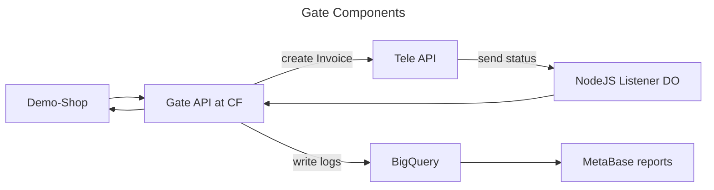

Initial doc: [[tele-merchant]].

## Goal:
Build MVP of merchant provider, that wraps telebot invoicing system in urls.
## Deliverables
- API — actually a product.
- Documentation — web page with docs on how to integrate with ours API
- Statistic Dashboard — web dashboard, where we can see latest transactions and their statuses. It should support different permission schemas.
- Demo Shop — environment where users could test app user flow of buying something with test or prod keys
### Tech
We will use [SvelteKit](https://svelte.dev/docs/kit/introduction) for building API and will host in on [CloudFlare Pages](https://pages.cloudflare.com/). For managing state we're going to use [DurableObjects on CloudFlare](https://developers.cloudflare.com/durable-objects/). For storing historical data we will use [Google BigQuery](https://cloud.google.com/bigquery). For building reports we will use self-hosted [MetaBase](https://www.metabase.com/) instance (we will use our instance at MVP stage). Because Tele API does not support HTTP based webhooks — we will have to build some small [nodejs](nodejs.org) service, for converting subscriptions to webhooks. We can host it on [digital ocean](digitalocean.com).

## Resources:
- domain
- cloudflare (card verification required)
	- pages
	- durable objects
	- email forwarding
- DigitalOcean (card verification required)
	- VPS
- google cloud (card verification required)
	- big query 
- NA
	- MetaBase instance
	- Bit account
	- email group forwarding

### Estimation
| Role       | rate | hours | total |
| ---------- | ---- | ----- | ----- |
| TeamLead   | 65   | 30    | 1950  |
| Full Stack | 36   | 80    | 2880  |
| DevOps     | 55   | 15    | 825   |
| QA         | 18   | 10    | 180   |
| Total      |      |       | 5835  |
