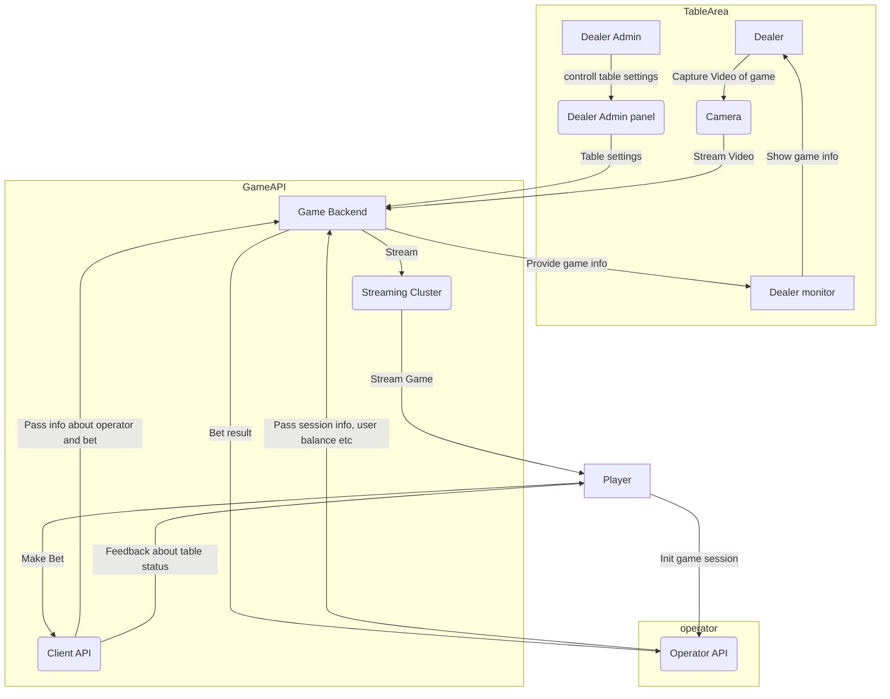

# Список функционала для LiveDealer
Основная цель: У заказчика есть определенное количество игровых столов. В виде трансляции (streaming через [nanocosmos](https://www.nanocosmos.de/v6/)) информацию продают партнерам (используют информацию на своем Back end и принимают ставки на игры которые требуют участия игрока)

Целью данной разработки является создание своего Back end, в который будет интегрироваться информация со столов. Два основное направления продажи: продажа залам как ядра системы для организации взаимодействия со столами, продажа платформам казино готовых игр.

Платформа будет B2B продуктом

## Полученные материалы
[Руководство_Пользователя_EmplAssistant.pdf](https://ipfs.io/ipfs/QmZ7MXzMxPAPK4dfq3HDDJPc3gPYSg8hezwUGgQVi1wJC9?filename=%D0%A0%D1%83%D0%BA%D0%BE%D0%B2%D0%BE%D0%B4%D1%81%D1%82%D0%B2%D0%BE_%D0%BF%D0%BE%D0%BB%D1%8C%D0%B7%D0%BE%D0%B2%D0%B0%D1%82%D0%B5%D0%BB%D1%8F_EmplAssistant.pdf)
## Функциональные требования к платформе:
- Учетная система персонала
должны быть предусмотрены разные уровни доступа (разные роли ролей).
На данный момент необходимо предусмотреть следующие роли:
    - dealer (в будущем необходимо учесть их классификацию в зависимости от опыта)
    - администратор зала (Big boss)
    - руководитель отделения

- Учетная запись персонала
Подразумевает ведение отчетов, получение задач - такой себе профиль сотрудинка где он может посмотреть свою наработку. Так же тут необходимо привязывать RFID карту сотрудника к его профилю.
Каждый сотрудник должен иметь возможность просмотра своего дохода в разрезе дня, использую свою RFID карту
- Управление часами работы
Со стороны платформы нужно управлять часами доступности самих столов\игр.
- Управление сменами сотрудников
Со стороны платформы необходимо распределять сотрудинков согласно схем, для заполнение необходимы часов работы.
Необходимо предусмотреть ведения общего графика сотрудников на месяц. Иметь возможность ежедневно вести посменный график с возможностью его редактирования
- Процедура замены сотрудника за столом
Смена персонала проходит по следующему процессу – раунд закончился (есть фиксированное время) и дилеры меняются местами. Авторизация за столом через RIFD карточку. Время игры останавливается. Запускается отчет до старта следующей игры с новым дилером
- Система штрафов сотрудников
Необходимо настроить систему штрафов для сотрудников с финальным подтверждением администратора зала
- API интеграции с платформой (передача данных о балансе, игровой сессии)
При инициализации сессии приходит по АПИ от партнера:
    - В какой игре была произведена ставка
    - В какой валюте ставка
    - Какой номинал ставок
    - User detail = ID, nick name, 
    - токен авторизации между двумя Back end: нашим и оператора
    - Данные о кошельке пользователя до начала игры
В ответ мы отправляем:
    - об исходе игры, и сколько необходимо зачислить на счет данному игроку.

Основные сценарии
        - Authorized
        - Do – bet
        - Do – win – выплата из нашей системы
        - Do roll back -  отказ, отмена системы
        - Un authorized

- Административная панель для управления игровыми интеграциями с партнерами
Необходима для генерации ключей для S2S выводов, просмотра истории запросов, расчета коммисий

- WEB интерфейс лобби всех наших игр
Необходим чтобы иметь возможность смены стола, не выходя из сессии игры.
- WEB интерфейс каждой игры
У большинства игр есть своя уникальная механика, поэтому для них требуется свой кастомный интерфейс.
- Back end каждой игры
Это API самой игры, помимо реализации кастомной механики конкретной игры, должно поддерживать адаптацию к конретному столу.

- WEB интерфейс управления столом. Настройки стола
Настройки стола хранятся на Back end, и долюны задавать параметры адаптации. К примеру максимальная\минимальная ставка на столе, максимальное количество игроков и т.п.

- Видео стримминг
Это отдельная часть системы, состоящая из трех глобалных модулей
        - модуль захвата видео в зале и трансляции в кластер
        - кластер узлов вещания
        - балансировщик

- Экран и интерфейс дилера
Рабочее место дилера, где он видит как статус сессии так и чат.
- Создание админки чата
Если необхо реализовать онлайн чат между игроками то необходима и модерация.
- Создание панели дилера-админа зала
Тут происходит он управляет игрой, настраиваются ее параметры и при необходимости корректируются ошибки, так же при необходимости можно управлять и чатом (бан пользователей, маск и т.п.)
Идентификатором каждой раздачи служит код раунда
- Back end панели дилера-админа
Каждый диллер авторизуется за своим столом (используя сканеры).
Должны соблюдаться смены диллеров.
Фиксирование данных о каждой раздаче.
Супер админ должен иметь возможность пересчитать раунд.
Должна быть возможность ручного ввода результата в случае сбоя.
Смена карт, шарика рулетки, игральных кубиков. Контроль данных действий.
Отчетность об анализе игры пользователя.
Другие KPI платформы.
Интеграция ридеров, сканеров, других технических девайсов к Back end дилера и  Back end оператора зала.
Back end административной панели для управления игрой. 
Дублирование правил каждой игры на Back end
Каждая игра имеет свои определенные правила. Настройки игры пользователь не настраивает у нас на платформе. 
Это все делается на Back end оператора. Настройка должна быть многие ко многим (разные операторы, разные игры, разные столы)
Информацию о настройках игры необходимо хранить у нас на back end. 
В зависимости от какого оператора пользователь авторизовался, такие настройки ему и будут предоставлены: шаг ставки, мин, макс, …
Настройки отображаем на пользовательском фронте

### Support

### Важные моменты

Согласовать с клиентом стоимость системы https://flussonic.com/
- Fixed cost
- Other cost

Платформа должна быть мультивалютной

С каждым партнером должны быть настройки лимитов. 
Они могут зависеть от валюты кошелька

В зависимости от правил игры и настроек колоды есть ограничения по количеству игроков.

Есть игры в которых нет ограничений на количество игроков.

Пользователь платформы одновременно не может играть за несколькими столами. У нас мы ожидаем один человек = одна игра, один стол
На 2 этапе необходимо заложить следующий функционал
Если оператор поддерживает функционал MTT (multi tabling), то платформа должна предоставить данную возможность

## Правила

[правила рулетки](https://drive.google.com/file/d/1Cx9MdnHxH9Px_gio8rVdRVQMg1hcArxx/view?usp=sharing)
[правила блекджека](https://drive.google.com/file/d/1eZH6wBb3XSnIxtoyzkSw461Y5kwFPwqL/view?usp=sharing)
[правила баккарата](https://drive.google.com/file/d/1IK-djsEePJH_ll67EDY4vzUtLZqVbOlA/view?usp=sharing)

## View

### Оценка временных трудозатрат

1. Рельсы для приложения управления столами/персоналом
	1. авторизация пользователей в админке
	2. регистрация пользователей в админке
	3. сброс паролей пользователей
	4. удаление/создание пользователей
	5. Добавление/удаление ролей пользователям
2. Управление столами
	1. Заведение стола
	2. Установка расписания работы стола
	3. Установка параметров стола (максимальная/минимальная ставка, игра и т.п.)
	4. Установка параметров игры (адрес сервера стримминга, количество карт и т.п.)
3. Управление персоналом
	1. Профиль человека
	2. Управление расписанием человека (вывести на смену, не пришел на смену, замены и т.п.)
	3. Управление часами человека (добавить/убрать, отпуск)
	4. Наложение штрафов
4. Управление залом
	1. замена сотрудника за столом
	2. пересчет карт
	3. иные специфичные для зала операции
5. Кластер трансляции
	1. Рельсы для запуска узла кластера
	2. Механизм discovery узлов
	3. Механизм выпуска JWT ключей для подключения
6. API интеграции с поставщиками игр
	1. Рельсы для запуска
7. Реализация игры (повторяющийся блок, для каждой игры)
	1. АПИ для игры которое втыкается в АПИ с прошлого пункта
	2. Интеграция с кластером трансляции
	3. Собственно АПИ самой игры
	4. Веб приложение игры
	5. Веб приложение дилера
	6. Веб приложение админа
8. Чат
	1. Бекенд для чата
	2. интеграция с API поставщика игр
	3. фронт часть чата для игр
9. Аналитический интерфейс
	1. Развернуть MB и подключить к источникам данных
	2. Разработать отчеты
	3. Встроить отчеты в админку для дилеров.
4. 

N    | что | Бек | Фронт | ДевОпс | спринтов
---- | ---- | ---- | ----   | ----        | ---- 
1.| Рельсы для приложения управления столами/персоналом | 1 | 1 | 1 | 1 | 1
1.1. | авторизация пользователей в админке | | | |
1.2. | регистрация пользователей в админке | | | | 
1.3. | сброс паролей пользователей | | | |
1.4. | удаление/создание пользователей
1.5. | Добавление/удаление ролей пользователям

| Кто |  |  |
| ---------| ---------- | -------------------- | ------------------------------------- |
| бекенд | | |
| бекенд | | |
| фронтенд | | |
| фронтенд | | |
| Девопс | | |

| Функционал| Дата начала работ| Дата окончания работ | Затраты в часах                      |
| ---------| ---------- | -------------------- | ------------------------------------- |
|Учетная система персонала||||
| Учетная запись персонала||||
| Управление часами работы||||
| Управление сменами сотрудников||||
|Процедура замены сотрудника за столом||||
|Система штрафов||||
| API интеграции с платформой (передача данных о балансе, игровой сессии)||||
|Административная панель для управления игровыми интеграциями с партнерами ||||
| WEB интерфейс лобби всех наших игр||||
| WEB интерфейс каждой игры||||
| Back end каждой игры||||
| WEB интерфейс управления столом. Настройки стола||||
| Видео стримминг||||
| Экран и интерфейс дилера||||
| Создание админки чата||||
| Создание панели дилера-админа зала||||
| Back end панели дилера-админа||||
