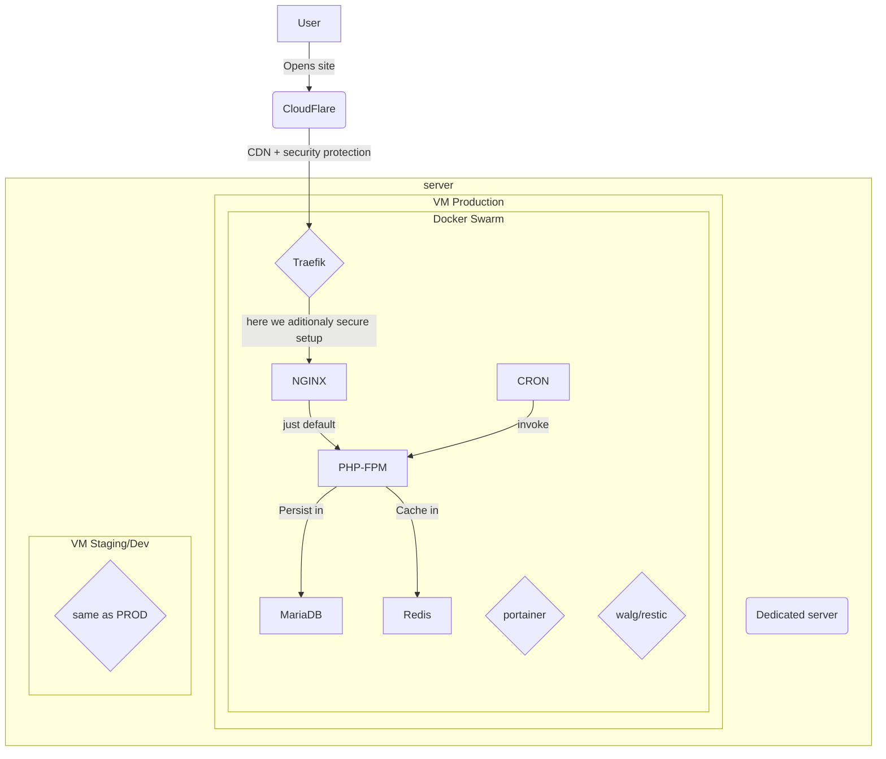

## Goal: provide infrastructure solution for PIM
## Tasks:
- dedicated environment in TIER3 Datacenter
- ability to separate dev/stage/prod env
- ability to launch copy of prod environment locally
- external firewall in front of PIM
- automatic deployment based on git branches
- backups
- monitoring

## Proposed solution:
### Hosting
We propose to use ovh.ie dedicated servers. [Infa-3](https://us.ovhcloud.com/bare-metal/infra/infra-3-le/) 
Price: ~240 EUR
CPU: AMD Epyc 7371 16 cores / 32 threads - 3.1 GHz
Storage: 2×960 GB SSD NVMe
Memory: 128 GB DDR4 ECC
Exact model to be discussed (cheaper or more expensive models are available)

We are aware that any DC can have downtime, it's not HA solution. But price/quality is very high.

### Code Hosting
We have self-hosted BitBucket with ready to go bamboo pipelines. We can use it for code and build/deploy.
### Solution

- We use [CloudFlare](https://www.cloudflare.com/) as the first layer of monitoring/protection. Even on a base free plan, it allows monitoring origin downtime and protect setup from different threads.
- We use dedicated server for best cost to performance ratio.
- We are using [Hyper-V server](https://en.wikipedia.org/wiki/Hyper-V) (based on the free edition of the Windows server) to host virtual-machines on the bare-metal server. It allows us to use proprietary drivers for boosting performance.
- We split server onto VMs, to fully isolate environments (prod, stage, pre-stage)
- We use [docker-swarm](https://docs.docker.com/engine/swarm/) for container orchestration inside VM. 
- We use [Portainer.io](Portainer.io) to provide manual controlling UI
- We use [MariaDB](https://mariadb.org/) instead of MySQL to get better performance/memory footprint
- We use [Traefik](https://traefik.io/) as ingress controller to filter all HTTP/TCP traffic
- We use [Wal-G](https://github.com/wal-g/wal-g) to create DB incremental DB backups
- We use [Restic](https://restic.net/) to create incremental backups of files and assets from volumes
- We use S3 compatible storage (prefer Google Cloud) to store backups outside of datacenter.

## Possible bottlenecks
- setting OVH server could be time-consuming
- access provisioning (access to OVH, CloudFlare accounts)
- we will block ability of manual class creation in UI. It's required to make dev -> pre-stage -> stage -> prod pipelines. It will block usage of part of functionality that are present in PimCore UI.

## Implementation Flow
### Order Server
At first you have to create account at [ovh.ie](https://ovh.ie) and pass customer validation there (provide documents, if you have VAT you will have to make additional steps). This step mostly depends on you.
After account verification, we can order a server. It takes from 2 to 7 days from OVH to deliver server. Then we have to buy IP addresses to server. It takes from 1 to 2 days to deliver ip's and attach them to server.
If you want, we can use another hosting provider, but be aware that cheaper solutions like Hetzner usually require more efforts on a setup stage because of missing KVM etc.
This stage could be time-consuming in calendar days and it depends on you mostly.
### Setup server
On that step we have to
- verify that server works (make hardware test, it takes 2-4 hours, but allows finding out hardware problems before going live)
- install host system
- install VMs
- add basic protection (firewall, port knocking etc.)
- add basic vm setup

This step usually takes near 1 working day to finish that step.

### Setup cluster and domain
On this step, we need to setup domain to access resources. We will ask you to setup CloudFlare account, pass domain for staging and production to it (two different domains). We will ask to share that account to `dev@nodeart.io`
Then we will integrate it with proxies to automate wildcard certificate provisioning. Also on that step we can setup additional firewall and WAF protection and other things related to CloudFlare,

This step usually takes up to 1 working day (mostly depends on getting access to CF).
### Setup git and basic CI/CD
We use our own BitBucket Git and own Bamboo runner and own Harbor Registry to store images. If you want to move those parts to yours infra – this is out of scope of current document.
On that step we push initial PIM skeleton to repo, setup access rules to repo and CI. Also on that step we create docker-app that also used for local development.

This step usually takes up to 2 working day.

## Setup backups
We use some external tooling to create backups, on that step we need S3 compatible storage that we can use to store backups. We mostly use Google Cloud Storage, but we can use AWS or CloudFlare R2. We need to set up that tooling, add secrets, and check that backups are restorable.

This step usually takes up to 1 working day.

## Questions to answer:
- is it ok to go with OVH for you?
- is it ok to use CloudFlare to control domains? (you need to move your NS servers to CloudFlare)
- do you need to use custom frontend for PimCore documents, or plan to use it as a headless solution or like PIM without customer frontend? (if needed we will add Vite)

## Time Frame
- setup server and accounts from your side: could take up to 1-2 weeks
- setup from our side could take up to 1 week
-

action | calendar time | working time
----- | ---- | ----
Order Server | 7-14d | 2h+ |
Setup server |  | 1d+ |
Setup cluster and domain |  | 1d+ |
Setup git and basic CI/CD |  | 2d+ |
Setup backups | | 1d |