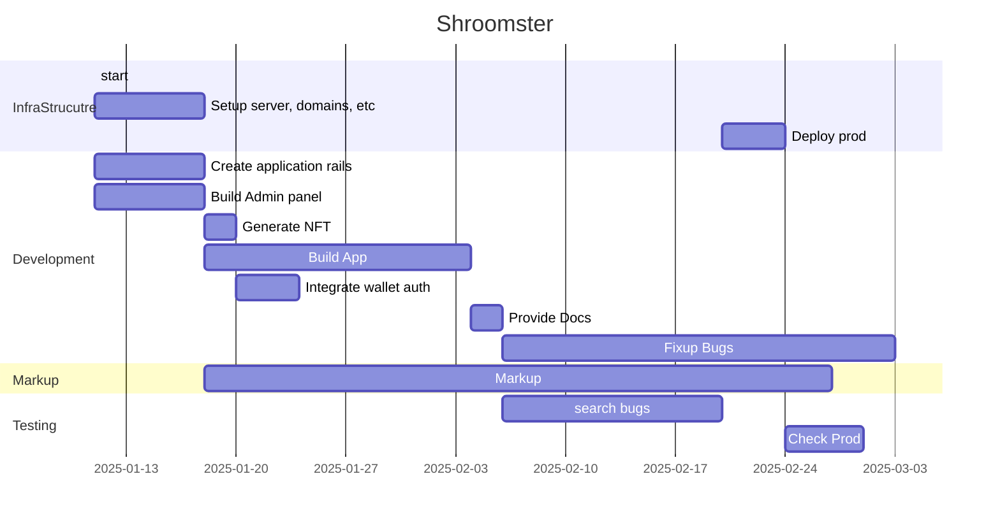

Input:
- [specification](https://docs.google.com/document/d/1IZzcRg6NO-mDrIsDPi13qCeaHP4KwKyD/edit?usp=drivesdk&ouid=100322526538225151495&rtpof=true&sd=true)
- [figma](https://www.figma.com/design/mXcwoapHmbHBFcuZKdJugr/Crypto-tapper)
Goal:
	Draw estimation if Shroomsters project

| Role   | 1 month | 2 month | Total | Rate | Total |
| ------ | ------- | ------- | ----- | ---- | ----- |
| Project Manager   | 80      | 80      | 160   | 21   | 3360  |
| FullStack Developer     | 168     | 80      | 248   | 35   | 8680  |
|Frontend Developer (MarkUp) |100      | 80      | 180   | 18   | 3240  |
| DevOps | 40      | 10      | 50    | 55   | 2750  |
| QA     |     |  60       | 60    | 20   | 1200  |
|        |         |         |       |      | 19230 |
### App structure
App contains 3 modules: web app, server, strapi.

#### WebApp
It's a web application with TG context integration. We use [SvelteKit](https://svelte.dev/docs/kit/introduction) to build fast and robust app. Also, it's much smaller than typical SPA.
#### Server
It's a [nodejs](https://nodejs.org/en) server build with [fastify](https://fastify.dev/). It allows us to handle lots of requests. Because of the nature of an app our backend works within 2 different storage engines. [Redis](https://redis.io) KV as a user database, where we store current values. Also, we make use of [Google BigQuery](https://cloud.google.com/bigquery?hl=en) to store history of balance updates etc.
#### CMS
As an admin panel we use [strapi](https://strapi.io), it's a pretty solid instrument to provide user-friendly admin panel to customers. Here you can control TG invites, math etc.
#### BI
Because all historical data stored in BQ, you can easily make reports\dashboards in any BI system. If [Metabase](https://metabase.com) is ok for you — we can setup it for you.

### Infrastructure
WebApp deployed to CloudFlare pages. Assets from Strapi deployed to CloudFlare R2. You will have to pay for CloudFlare services.
Server and CMS deployed to dedicated server in a docker swarm cluster. We have to rent a server for that. In common we usually stick to [OVH.ie](https://fastify.dev/), if its ok - you will have to pass KYC there and we will be able to deploy there.
Stage-Prod: there will be 2 environments (stage and prod). Be aware that they will not sync automaticaly.
### Gant
