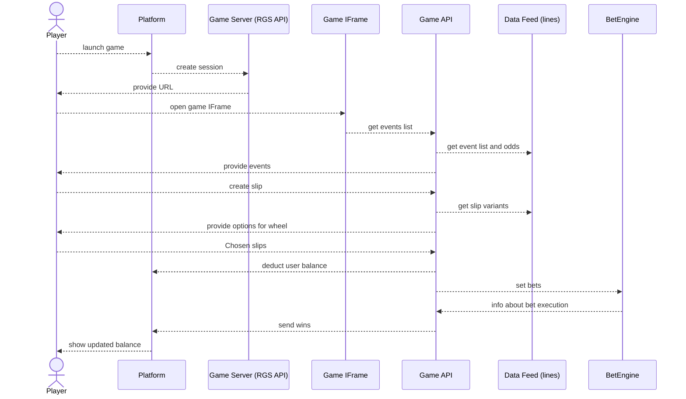

# FlashBet

Goal: Build a prototype that allows checking the game flow on mocked data. Provide API contracts that should be implemented by the platform.

### Flow

### Components

### Platform
The casino platform. For testing purposes, we will create game launcher which implements an API and allows creating a session with a defined currency and amount.

### Game Server (RGS API)
This is the entry point for the Casino. It should implement the base RGS contract ([example here](https://realliveslots.com/docs/api#initialize-a-session)). After game session initialization, it stores user data in the DB. Also, this server sends postbacks to the casino to alter the user balance.

> ::: danger
> The sessions from the casino should have a long time limit (like a few days) to work with bets. Default timeout is 1 day.

### Game IFrame
This is the Game UI. It can be accessed via a public URL with the `sessionId` in the URL. The `sessionId` acts as our token to make requests to the Game API.

### Game API
The Game API for the user interface in the IFrame; it is publicly available. This API implements the following methods:
- `/api/auth`: Method to get a new token for session extension.
- `/api/session`: Provides info about the current session (like username, currency, etc.).
- `/api/wallet`: Gets the latest user balance.
- `/api/data/leagues`: Provides info about available leagues.
- `/api/data/leagues/{id}`: Provides info about matches available for betting.
- `/api/bet/generate`: Accepts league and initial slip, and outputs a list of sectors for the wheel.
- `/api/bet/place`: Places a bet using the slips from the previous step.
- `/api/bet/history`: Gets the last bets and their statuses attached to the user.

### Data Feed
This is actually another service that depends on the exact provider. 
> ::: info
> For now, we will use a mock data feed with no real data.

We can have different data feed services based on the supplier, but we need to provide one API protocol to the Game API, like:
- `/data/leagues`
- `/data/leagues/{id}`
- `/bet/generate`

It means that we will need to rewrite this module for every data feed that we want to support. However, it should not affect other parts of the game.

### Bet Engine
This is a wrapper server that implements integration with the Betting provider.

>::: info
> For now, we will mock the betting engine.

It provides an API for the Game API with one method:
- `/api/bet`: Takes `userId`, bet amount, and slip.

Also, it makes a callback request to the Game API to inform about statuses.

## Pain Points
- Time-based attacks: We need to implement a mechanism to extend session duration and update all coefficients by that extension.
- Using a mock API for the Data Feed and Bet Engine is good for prototyping, but will not allow earning money on the game.

## Design

### Screens

- Loader
- League selection
- Match selection
- Wheel
- History page

The design should be done in Figma. The design should avoid using any raster images and, if possible, avoid using any letters (use symbols where possible). Most of our players are mobile users with poor internet quality.

## Scope of Work
- Create Figma design for the game
- Game Launcher
- Game Server
- Game API Server
- Data Feed Server
- Mock Data Feed
- Bet Engine Server
- Mock Bet Server
- API Documentation
- CI/CD Pipelines

## Timeline

The project should be completed in 2.5 months. Work should be done in 2-week sprints.

1. Sprint 1: Design and Rails
We need to create and agree on the design. Also, in this step, we have to rent a server and set up the rails for the new project (CI/CD, static checks, etc.). We also need to make Swagger files for all APIs.
On the backend side, we need to write the Game Server during this step.

Involvement:
- Designer
- Backend Developer
- Project Manager
- DevOps Engineer

2. Sprint 2: Game Server
We need to implement the Game API Server. It should be able to handle all game logic with mocked data. Also, we start implementing the frontend part of the game.

Involvement:
- Frontend Developer
- Backend Developer
- Project Manager

3. Sprint 3: Work on Server
We need to implement the Data Feed Server and Bet Engine Server. We also continue working on the frontend.

Involvement:
- Frontend Developer
- Backend Developer
- Project Manager
- QA Engineer

4. Sprint 4: Work on Server
Continue server implementation and frontend development.

Involvement:
- Frontend Developer
- Backend Developer
- Project Manager
- QA Engineer

5. Sprint 5: Stabilization
Stabilize the game and fix bugs.

Involvement:
- Frontend Developer
- Backend Developer
- Project Manager
- QA Engineer

## Estimation
Normal:

| role\spint | 1   | 2   | 3   | 4   | 5   | hours | rate | total |
| ---------- | --- | --- | --- | --- | --- | ----- | ---- | ----- |
| Designer   | 80  | 40  |     |     |     | 120   | 30   | 3600  |
| Project    | 80  | 80  | 80  | 80  | 80  | 400   | 23   | 9200  |
| TeamLead   | 20  | 20  | 20  | 20  | 20  | 100   | 50   | 5000  |
| Frontend   |     | 80  | 80  | 80  | 80  | 320   | 35   | 11200 |
| Backend    | 80  | 80  | 80  | 80  | 80  | 400   | 40   | 16000 |
| DevOps     | 80  | 10  | 10  | 10  | 20  | 130   | 50   | 6500  |
| QA         |     |     | 40  | 80  | 80  | 240   | 15   | 3000  |
total: 62140 usd

Minimal:

| role\spint | 1   | 2   | 3   | 4   | 5   | hours | rate | total |
| ---------- | --- | --- | --- | --- | --- | ----- | ---- | ----- |
| Designer   | 80  | 40  |     |     |     | 120   | 30   | 3600  |
| TeamLead   | 20  | 20  | 20  | 20  | 20  | 100   | 50   | 5000  |
| Frontend   |     | 80  | 80  | 80  | 80  | 320   | 28   | 8960  |
| Backend    | 80  | 80  | 80  | 80  | 80  | 400   | 40   | 16000 |
| DevOps     | 80  | 10  | 10  | 10  | 20  | 130   | 50   | 6500  |
| QA         |     |     | 40  | 80  | 80  | 200   | 15   | 3000  |
total: 43060 usd

> :: Danger ::
> Provided numbers is estimation, it's not an obligation. The real numbers could differ depending on design and other inputs during the process.