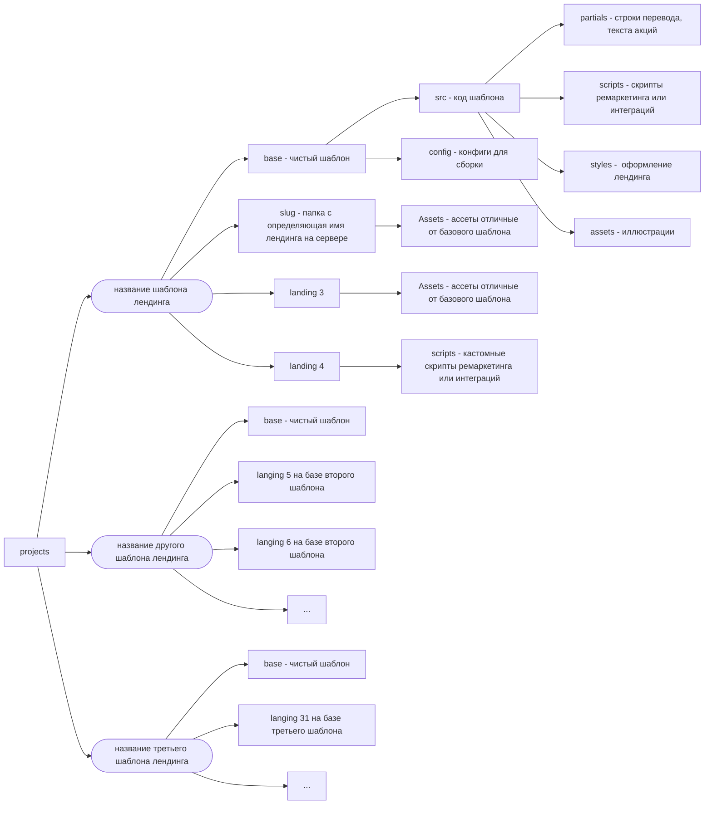

# Клиент: KBC
## Домен: 
[[iGaming]], [[Marketing]]
#iGaming #Marketing 
## Какие задачи перед нами ставились / Какие проблемы решали :
- массовое производство лендингов для промокомпаний
- интеграция с бекендом WhiteLabel продукта
## Как реализовали:
Сделан конструктор позволяющий вести несколько базовых лендингов и поддерживать много модификаций используя упрощенный флоу добавления лендинга просто созданием папки с ассетами и наполнением (или без наполнения).
Основная сложность, что этих лендингов очень много, и при этом иногда меняется базовая логика вроде интеграции с бекендом WhiteLabel продукта.  Соответственно реализован механизм наследования скриптов и шаблонов с возможностью их модификации для конкретного лендинга. Созданный конструктор позволяет быстро добавлять новые промо лендинги без опасения поломки уже существующих, так же централизованно вносить правки в скрипты используемые на всех лендингах.

## Какие технологии мы использовали: 
#Gulp, #WebPack, #Svelte, #SCSS, #FireBase, #EJS

## Сколько людей всего работали на проекте:
3 engineer, 1 devops engineer 

Таким образом у нас есть базовый шаблон, модификации которого мы создаем просто добавлением папок с именами новых лендингов и исключительно данных которые отличаются от базы (к примеру картинки или интеграции)

- Удобство локализации
- Удобство поддержки при наличии базовых сценариев
- Удобство встраивания кастомных интеграций (пиксели, трекеры и т.п.) [^1]
- Скорость добавления новых лендингов

[^1]: это важно когда много разных рекламных интеграций, с разными поставщиками трафика

--------

Client showcase: KingBilly Casino.  
  
Goals/Problems:  
Mass production of landings for promo campaigns and backend integration with white label casino product  
  
What was done:  
A constructor has been made that allows you to maintain several basic landings and support many modifications using a simplified flow of adding a landing by simply creating a folder with assets and content (or without content). The main difficulty is that there are a lot of these landings, and at the same time, the basic logic sometimes changes, such as integration with the White Label backend of the product. Accordingly, a mechanism for inheriting scripts and templates has been implemented with the possibility of modifying them for a specific landing page. The created constructor allows you to quickly add new promotional landings without fear of breaking existing ones, as well as centrally make changes to the scripts used on all landings.  
  
Used tech:  
Gulp, WebPack, Vite, Svelte, SCSS, Firebase, EJS, JavaScript, TypeScript