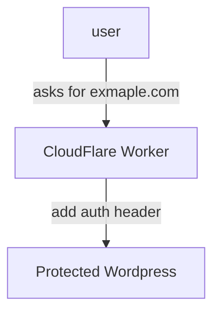

Goal: deploy multiple WordPress sites, hiding oridgings of content.

Schema:

The main idea is to use something like [CF workers reverse proxy](https://servebolt.com/help/cloudflare/cloudflare-workers-reverse-proxy/). In that way we do not expose WordPress to outer world, and can setup lost of hosts from different Cloudflare accounts, with one backbone content provider.

When user opens example.com, Cloudflare worker spins up, and makes a request to WP, but not just directly passing request — it adds auth header to it.
When traefik in front of WP gets request — it makes basic auth check. After request passed to WP.

The system above gives you an option to decrease support burdens for WP using [WP Multisite](https://developer.wordpress.org/advanced-administration/multisite/). In that case we actually use one WP admin panel to manage lots of sites. But, this mode also brings limitations on some plugins etc. We need to clarify first - is it ok, to serve our network via multisite feature, or not?

If it works like that, then we should think on how many sites we want to bring up, and choose propper server at OVH