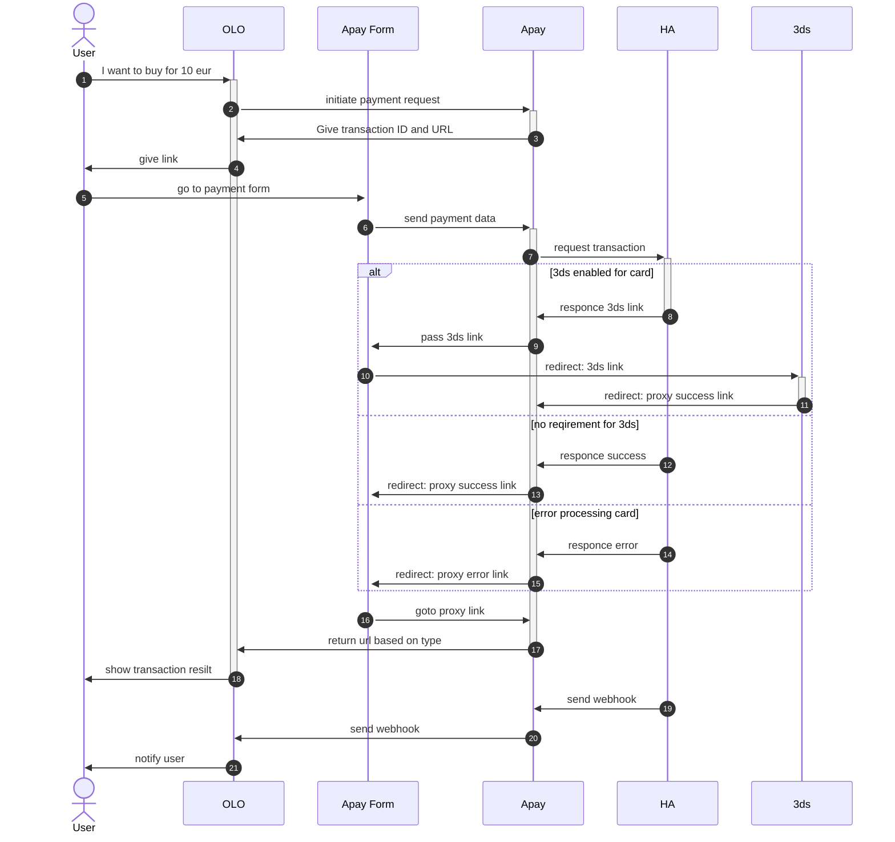

Базово опираемся на схему из https://api.apay.pp.ua/docs/internal/task

Goal: интегировать новое платежное направление HA

- в список поддерживаемых провайдеров добавить новый - ha (к примеру [тут](https://github.com/apayments/apayments.src/blob/main/configs/userKeys.json#L22))
- в метод инициализации платежа ([тут](https://github.com/apayments/apayments.src/blob/main/src/routes/api/v1/init-payment/%2Bserver.ts)) добавляем поддержку опциональных параметров
	- country
	- street
	- city
	- postal_code
	- state
	- customerLastName
	- phone
все новые параметры опциональны.

- для метода ha меняем возвращаемый url на новый
сейчас мы используем [/api/v1/integration/%provider%/process/](https://github.com/apayments/apayments.src/blob/main/src/routes/api/v1/integration/%5Bprovider%5D/process/%2Bserver.ts)
вместо этого предлагаю добавить /api/v1/integraion/ha/process, который был бы уже формой оплаты

- apay payment form
Платежная форма должна содержать предзаполненые данные, которые соответствуют тому что пришло при инициализации платежа, если данных нет - мы предлагаем человеку их заполнить.

Платежная форма должна быть разбита на два степа (степпер). На первом экране человек вносит данные карты и фио, на втором экране человек вносит данные об адресе (если они не были предзаполнены). Если какие-то поля переданы на уровне генерации запроса на оплату - мы их не выводим и скрываем.

- сабмит платежной формы
при сабмите платежной формы мы должны обогатить введенные данные информаций об ip человека и сделать запрос к HA серверу для обработки платежа. Как урл для успешного платежа необходимо передать [/api/v1/integration/ha/success/](https://github.com/apayments/apayments.src/blob/main/src/routes/api/v1/integration/%5Bprovider%5D/success/%2Bserver.ts). 
Мы при сабмите формы в любом случае делаем редирект, просто в зависимости от ответа апи это либо 3ds ссылка, либо success прокси, либо error proxy.

Все данные отправляемые в HA апи необходимо логировать (в том числе данные ип и карты)
## Макет платежной формы
![[{B2A5B896-CFB2-4E0D-AFB0-8B45D941840B}.png]]
Валидация полей - на самом деле нам не нужно на данный момент валидировать поля. Непонятно есть ли вообще какая-то валидация у ннижележащей системы. Пустоту она тоже принимает