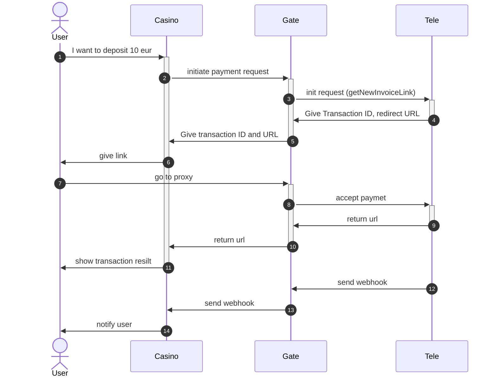

Goal: we want to use Tele.Store as merchant to process our payments. Mostly we want to process web-clients. We need to clarify the userflow. 

Input:
- [miniApp concept Doc](https://docs.google.com/document/d/1bfWTEDWDp0RoYd4mArW8SwnJ7SWfsn2tAGdZpAsOM1c/edit?tab=t.0)
- [swagger dead](https://dev.tele.store:8081/trex/swagger/index.html)
- [SDK doc](https://github.com/telestore-rep/SDK/tree/main/JavaScript)
## Instruments

- sveltekit, cloudlfare pages, cloudflare kv, google bigquery, metabase

## Flow



2. Initiate payment method from Casnio to Gate
   POST /api/v1/init-payment
   Header Authorization: Token

```json
{
	"id": "sddc", // transaction id, used to identify posback, if no id - no postback
	"customerEmail": "user@example.com", // validated user email, optional
	"customerName": "UserName", // username, optional field
	"amount": 100, // amount of transaction
	"currency": "USD", // three-letter ISO currency code, or "TeleUSD" if ommited
	"successUrl": "https://casino.com/success", // where to redirect user after successful payment
	"errorUrl": "https://casino.com/error", // where to redirect user after unsuccessfull payment
	"postbackUrl": "https://casino.com/api/payment-verify" // where to send payment notify
}
```

We store all that data in BQ for further analysis.
If data validated, we proceed request to Tele. 
3. We send request to Tele, with the same params, but making substitution to our fields.
Tele init (CreateInvoice):

```json
{
	"amount": 100, // amount of transaction
	"currency": "TUSD", // we always invoke transasctions in teleusd (with some conversion rate)
	"appId": "<YOUR_APP_ID>",
	"partnerInfo": {
		"id": "ourintrenalid", // transaction id, used to identify posback, if no id - no postback
		"email": "user@example.com", // user email
		"name": "UserName", // username, optional field
		"successUrl": "https://gate.com/integration/success", // where to redirect user after successful payment
		"errorUrl": "https://gate.com/integration/error", // where to redirect user after unsuccessfull payment
		"postbackUrl": "https://gate.com/api/payment-verify" // where to send payment notify
	}
}
```

4. Getting response from Tele

```json
{
	"url": "paymentlink.tele.com"
}
```

6. Attaching Tele responce to initial BQ data regarding transaction, storing url and ids in KV, and giving our wrapper url to shop.

```json
{
	"status": "success",
	"id": "id",
	"url": "gate.com/integration/pay?id=xxxx"
}
```

7. When user gets to our link, we unpack real payment url stored in KV and redirect user there,
8. user gets to tele and makes a payment
9. user redirected to our success/error wrapper
10. we restore casino urls from wrapper, and redirect user them
11. when we got payment postback, we get id from kv and transfer it to casino

## Functional blocks

### API

Actually api, with login of all transactions in KV.

### DOCS

Public docs, on how to integrate with our payment api

### Internal DOCs

password-protected docs, with info on how to add new tokens and how to measure stats

### Reporting

Metabase dashboards, embedded into app to show stats and filters for customer.


## Questions
- It would be nice move to webhooks instead of [subscriptions](https://github.com/telestore-rep/SDK/blob/main/JavaScript/src/index.ts#L92) at SDK. We would like to use cloudlfare pages, which has limitations on long running tasks (but it good in handling http requests).
- it would be pleasant to get access to swagger.
- it would be nice to use named constants in [sdk](https://github.com/telestore-rep/SDK/blob/main/JavaScript/src/index.ts#L121) to make it easier to understand.
- if user wants to make a payment in TG, how we should integrate it within site? There is no redirect upon success.