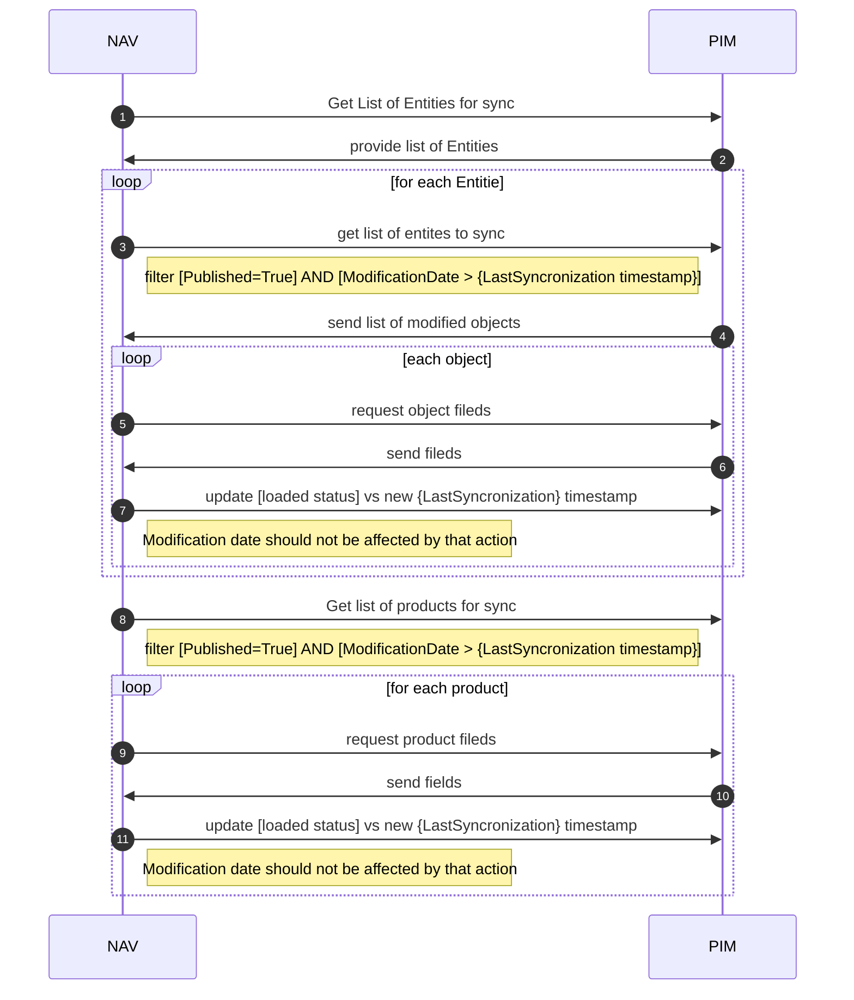

# Pim-Nav интеграция
Процесс интеграции выглядит так:

## Со стороны NA необходимо:
1. Карта объектов для синхронизации
- сопоставление справочников в PIM справочникам в NAV
- сопоставление атрибутов справочников, какие атрибуты в NAV должны соответствовать каким в PIM, необходимо снабдить примерами, для того чтобы понимать размерности (ENUM vs int vs String)
К примеру

| PIM Entity | PIM Attribute | NAV Entity          | NAV Attribute    | PIM Value  | NAV Value |
| ---------- | ------------- | ------------------- | ---------------- | ---------- | --------- |
| SolarTypes | Sensitivity   | No, ENUM in Product | SolarSensitivity | 60тугриков | 60        |

В примере выше мы смотрим абстрактную светочувствительность. В PIM у нас для нее есть справочник, в то время как в NAV это аттрибут продукта, отдельного справочника нет. В PIM мы храним строчные значения, в NAV храним цифру с размером светочувствительности.
Нам необходимо проработать как мы будем синхронизировать PIM и NAV и для этого нам нужно понимать - какие справочники мы должны синхронизировать, какие справочники не представлены в виде справочников в какой-либо из сторон, где у нас типы значений не совпадают. Пример выше содержит все возможные проблемы.

2. Метод для обновления [loaded status] без изменения [modification date]
Метод необходимо разработать, так чтобы изолировать влияние установки статусов импорта со стороны NAV на синхронизацию.

## Со стороны BRD необходимо:
1. Провести исследование возможности использования готовых коннекторов к GraphQL/использования CodeGen утилит для упрощения обмена.
Ожидается что возможно будет использовать методы интроспекции для автоматизации обмена. Либо интегрировав полноценный коннектор для GQL, который бы позволил использовать его как источник данных внутри NAV.
Если коннектор для NAV отсутствует можно упростить написание коннектора используя кодогенерацию через методы интроспекции.
Пример можно посмотреть на сайте [CodeGen](https://www.graphql-code-generator.com/) В нем есть поддержка генерации типов для C# Такой путь не настолько удобен как коннектор данных, но все же лучше, чем указание запросов руками.
На выходе мы ожидаем что можно будет реализовать схему, приведенную выше в файле.
Если коннекторов/инструментов со стороны NAV найти не получится мы всегда можем сделать фолбек на использование захардкоженых запросов.

2. Поднять тестовую среду для настройки интеграции PIM/NAV
Важно: среда должна иметь копию данных, для обеспечения тестового набора для синхронизации.

Contracts: [[BRD-NAW-Contracts]]