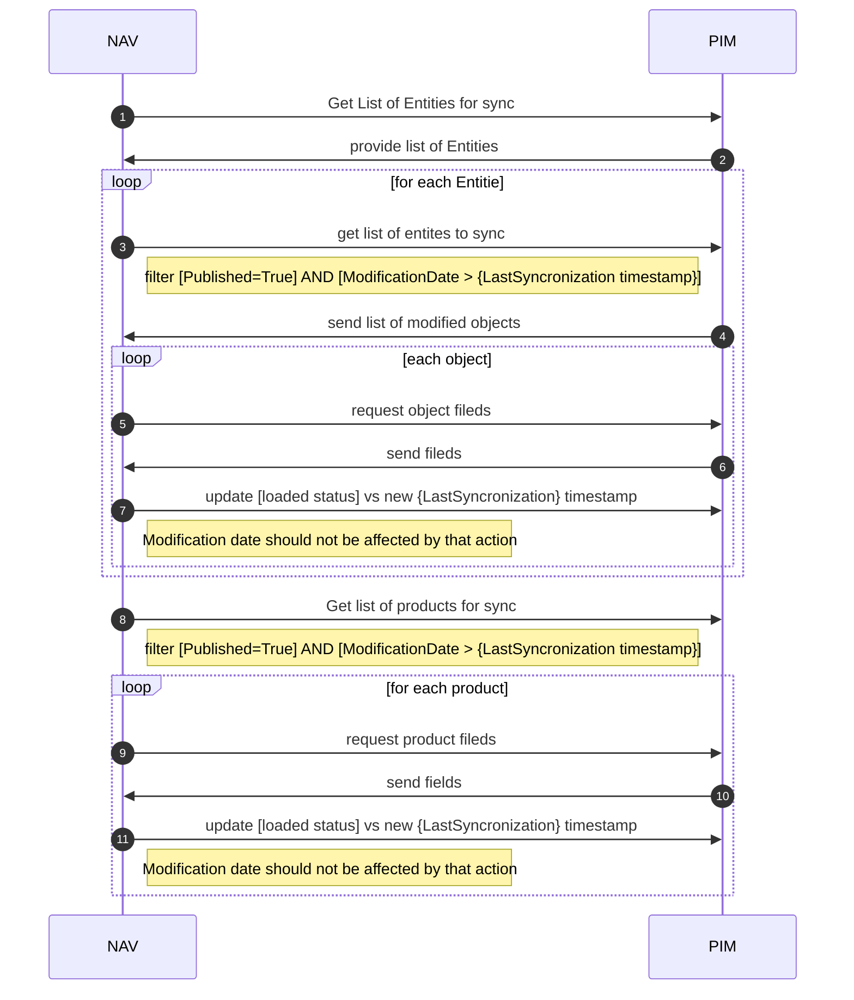

# Navision PIM integration

Для интеграции PIM и NAV предлагается использовать [GraphQL API](https://graphql.org/). Таким образом NAV сможет сам выбрать какие данные, за какой период и когда ему нужны.

Чтобы продемонстрировать работу на стейдже собрано небольшое два небольших демо запроса:

## Работа с продуктами
Текст запроса на получение группы продуктов

[Консоль для ввода запросов](https://pim-stage.brocard.ua/pimcore-datahub-webservices/explorer/apidemo?apikey=1234567890123456qwerty)

```graphql
query { # это запрос на получение данных, можно так же сделать запрос на изменение данных
  getProductListing(
    # в рамках запроса можно указать язык для локалзизуемых полей
    defaultLanguage: "ru", 
    # можно делать пагинацию, к примеру тут мы пропускаем первые 5 и берем 10 елементов
    first: 10, 
    after: 5, 
    # можно задать сортировку, к примере по дате модификации в убывающем порядке
    sortBy: "o_modificationDate",
    sortOrder: "DESC",
    # самое ВАЖНОЕ! Фильтра, к примеру по дате изменения     
    filter: "{\"o_modificationDate\": {\"$gt\" :\"1573745345\"}}" ) {
    # сколько всего записей попадает в выборку     
    totalCount,
    edges {
    # список полей для выборки
      node {
        id, # PIMCore ID, предполагаемая замена Tetra ID
        article_no, # артикул
        barcode, # штрихкод
        barcodeVariants, # варианты штрихкодов
        base_price, # базовая цена
        # связь один ко многим, категория это справочник
        category: category {
          ... on object_category {
            id, # у полей справочника тоже есть PIMCore ID
            fullpath, # пояснение как выглядит полный путь к обьекту
            classname, # класс обьекта, это и путь выведенны для примера
          }
        },
        classname, # класс елемента
        code_tetra, # код тетры
        commercial_conditions, # это вычисляемое поле, которое расчитывается по формуле
        creationDate, # дата создания елемента в PIMCore
        modificationDate, # дата внесения измения в позиция
        # Тип продукта это тоже справочник         
        product_type: product_type {
          ... on object_productType {
            name, # у нас имена продуктов будут на русском, потому что мы указали
            # defaultLanguage: "ru" в начале запроса, и все локализуемые поля перевелись
            # в заданный язык либо вернули falback перевод
            id, # и у типов продуктов тоже ест PIMCore ID
            modificationDate # и дата внесения изменений
          }
        }
        # у продукта может быть очень много видов связей с разными справочкниками
        surface: surface {
          ... on object_productSurface {
            name,
            id,
            fullpath,
            
          }
        }
      }
    }
  } 
}
```

Выглядит это вот так


## Работа со справочниками
Текст запроса на получение справочника

```json
query { # это запрос на получение справочника
 getProductSurfaceListing(
  defaultLanguage: "ru" # локазиованные поля мы хотим на русском получить
) {
  totalCount, # количество елементов в справочнике
  edges {
    node {
      name, # имя елемента справочника на русском
      id, # PIMCore ID елемента справочника
      modificationDate, # дата изменения
      classname # имя класса
    }
 }
 }
}

# Важно понимать что доступные поля можно регулировать для каждого потребителя данных
# также нужно понимать что для крупных справочников стоит выгружать только измененные данные
# каждая система может иметь свою точку актуализации данных и получать только актуализированные
# для нее обновления используя modificationDate - общесистемный аттрибут который есть у всех
# обьектов системы, так же как и PIMCore ID.
```


[Ссылка на консоль с введенным запросом](https://pim-stage.brocard.ua/pimcore-datahub-webservices/explorer/apidemo?apikey=1234567890123456qwerty&query=query%20%7B%20%23%20%D1%8D%D1%82%D0%BE%20%D0%B7%D0%B0%D0%BF%D1%80%D0%BE%D1%81%20%D0%BD%D0%B0%20%D0%BF%D0%BE%D0%BB%D1%83%D1%87%D0%B5%D0%BD%D0%B8%D0%B5%20%D1%81%D0%BF%D1%80%D0%B0%D0%B2%D0%BE%D1%87%D0%BD%D0%B8%D0%BA%D0%B0%0A%20getProductSurfaceListing(%0A%20%20defaultLanguage%3A%20%22ru%22%20%23%20%D0%BB%D0%BE%D0%BA%D0%B0%D0%B7%D0%B8%D0%BE%D0%B2%D0%B0%D0%BD%D0%BD%D1%8B%D0%B5%20%D0%BF%D0%BE%D0%BB%D1%8F%20%D0%BC%D1%8B%20%D1%85%D0%BE%D1%82%D0%B8%D0%BC%20%D0%BD%D0%B0%20%D1%80%D1%83%D1%81%D1%81%D0%BA%D0%BE%D0%BC%20%D0%BF%D0%BE%D0%BB%D1%83%D1%87%D0%B8%D1%82%D1%8C%0A)%20%7B%0A%20%20totalCount%2C%20%23%20%D0%BA%D0%BE%D0%BB%D0%B8%D1%87%D0%B5%D1%81%D1%82%D0%B2%D0%BE%20%D0%B5%D0%BB%D0%B5%D0%BC%D0%B5%D0%BD%D1%82%D0%BE%D0%B2%20%D0%B2%20%D1%81%D0%BF%D1%80%D0%B0%D0%B2%D0%BE%D1%87%D0%BD%D0%B8%D0%BA%D0%B5%0A%20%20edges%20%7B%0A%20%20%20%20node%20%7B%0A%20%20%20%20%20%20name%2C%20%23%20%D0%B8%D0%BC%D1%8F%20%D0%B5%D0%BB%D0%B5%D0%BC%D0%B5%D0%BD%D1%82%D0%B0%20%D1%81%D0%BF%D1%80%D0%B0%D0%B2%D0%BE%D1%87%D0%BD%D0%B8%D0%BA%D0%B0%20%D0%BD%D0%B0%20%D1%80%D1%83%D1%81%D1%81%D0%BA%D0%BE%D0%BC%0A%20%20%20%20%20%20id%2C%20%23%20PIMCore%20ID%20%D0%B5%D0%BB%D0%B5%D0%BC%D0%B5%D0%BD%D1%82%D0%B0%20%D1%81%D0%BF%D1%80%D0%B0%D0%B2%D0%BE%D1%87%D0%BD%D0%B8%D0%BA%D0%B0%0A%20%20%20%20%20%20modificationDate%2C%20%23%20%D0%B4%D0%B0%D1%82%D0%B0%20%D0%B8%D0%B7%D0%BC%D0%B5%D0%BD%D0%B5%D0%BD%D0%B8%D1%8F%0A%20%20%20%20%20%20classname%20%23%20%D0%B8%D0%BC%D1%8F%20%D0%BA%D0%BB%D0%B0%D1%81%D1%81%D0%B0%0A%20%20%20%20%7D%0A%20%7D%0A%20%7D%0A%7D%0A%0A%23%20%D0%92%D0%B0%D0%B6%D0%BD%D0%BE%20%D0%BF%D0%BE%D0%BD%D0%B8%D0%BC%D0%B0%D1%82%D1%8C%20%D1%87%D1%82%D0%BE%20%D0%B4%D0%BE%D1%81%D1%82%D1%83%D0%BF%D0%BD%D1%8B%D0%B5%20%D0%BF%D0%BE%D0%BB%D1%8F%20%D0%BC%D0%BE%D0%B6%D0%BD%D0%BE%20%D1%80%D0%B5%D0%B3%D1%83%D0%BB%D0%B8%D1%80%D0%BE%D0%B2%D0%B0%D1%82%D1%8C%20%D0%B4%D0%BB%D1%8F%20%D0%BA%D0%B0%D0%B6%D0%B4%D0%BE%D0%B3%D0%BE%20%D0%BF%D0%BE%D1%82%D1%80%D0%B5%D0%B1%D0%B8%D1%82%D0%B5%D0%BB%D1%8F%20%D0%B4%D0%B0%D0%BD%D0%BD%D1%8B%D1%85%0A%23%20%D1%82%D0%B0%D0%BA%D0%B6%D0%B5%20%D0%BD%D1%83%D0%B6%D0%BD%D0%BE%20%D0%BF%D0%BE%D0%BD%D0%B8%D0%BC%D0%B0%D1%82%D1%8C%20%D1%87%D1%82%D0%BE%20%D0%B4%D0%BB%D1%8F%20%D0%BA%D1%80%D1%83%D0%BF%D0%BD%D1%8B%D1%85%20%D1%81%D0%BF%D1%80%D0%B0%D0%B2%D0%BE%D1%87%D0%BD%D0%B8%D0%BA%D0%BE%D0%B2%20%D1%81%D1%82%D0%BE%D0%B8%D1%82%20%D0%B2%D1%8B%D0%B3%D1%80%D1%83%D0%B6%D0%B0%D1%82%D1%8C%20%D1%82%D0%BE%D0%BB%D1%8C%D0%BA%D0%BE%20%D0%B8%D0%B7%D0%BC%D0%B5%D0%BD%D0%B5%D0%BD%D0%BD%D1%8B%D0%B5%20%D0%B4%D0%B0%D0%BD%D0%BD%D1%8B%D0%B5%0A%23%20%D0%BA%D0%B0%D0%B6%D0%B4%D0%B0%D1%8F%20%D1%81%D0%B8%D1%81%D1%82%D0%B5%D0%BC%D0%B0%20%D0%BC%D0%BE%D0%B6%D0%B5%D1%82%20%D0%B8%D0%BC%D0%B5%D1%82%D1%8C%20%D1%81%D0%B2%D0%BE%D1%8E%20%D1%82%D0%BE%D1%87%D0%BA%D1%83%20%D0%B0%D0%BA%D1%82%D1%83%D0%B0%D0%BB%D0%B8%D0%B7%D0%B0%D1%86%D0%B8%D0%B8%20%D0%B4%D0%B0%D0%BD%D0%BD%D1%8B%D1%85%20%D0%B8%20%D0%BF%D0%BE%D0%BB%D1%83%D1%87%D0%B0%D1%82%D1%8C%20%D1%82%D0%BE%D0%BB%D1%8C%D0%BA%D0%BE%20%D0%B0%D0%BA%D1%82%D1%83%D0%B0%D0%BB%D0%B8%D0%B7%D0%B8%D1%80%D0%BE%D0%B2%D0%B0%D0%BD%D0%BD%D1%8B%D0%B5%0A%23%20%D0%B4%D0%BB%D1%8F%20%D0%BD%D0%B5%D0%B5%20%D0%BE%D0%B1%D0%BD%D0%BE%D0%B2%D0%BB%D0%B5%D0%BD%D0%B8%D1%8F%20%D0%B8%D1%81%D0%BF%D0%BE%D0%BB%D1%8C%D0%B7%D1%83%D1%8F%20modificationDate%20-%20%D0%BE%D0%B1%D1%89%D0%B5%D1%81%D0%B8%D1%81%D1%82%D0%B5%D0%BC%D0%BD%D1%8B%D0%B9%20%D0%B0%D1%82%D1%82%D1%80%D0%B8%D0%B1%D1%83%D1%82%20%D0%BA%D0%BE%D1%82%D0%BE%D1%80%D1%8B%D0%B9%20%D0%B5%D1%81%D1%82%D1%8C%20%D1%83%20%D0%B2%D1%81%D0%B5%D1%85%0A%23%20%D0%BE%D0%B1%D1%8C%D0%B5%D0%BA%D1%82%D0%BE%D0%B2%20%D1%81%D0%B8%D1%81%D1%82%D0%B5%D0%BC%D1%8B%2C%20%D1%82%D0%B0%D0%BA%20%D0%B6%D0%B5%20%D0%BA%D0%B0%D0%BA%20%D0%B8%20PIMCore%20ID.)


## Консоль
В правой части консоли запросов есть кнопка DOCS

Которая открывает список доступных сущностей и полей для совершения запросов в GraphQL, используя ее можно легко понять какие данные в каком формате приходят

## Целостность данных
Для сохранения целостности и возможности инкрементального обновления стоит опираться на параметр *PIMCore ID* существующий у любого объекта, как у справочкника, так и у товара.

# Флоу работы с каталогом и справочниками

    
## Метод для обновления NavLoadedStatus в PIM
Метод для обновления [loaded status] без изменения [modification date]
Метод необходимо разработать, так, чтобы изолировать влияние установки статусов импорта со стороны NAV на синхронизацию.
Таким образом установка статуса повлияет на доступность товара\справочника другим интеграциям, но при этом изменение атрибута не будет вызывать переимпорт всех товаров в NAV.

Метод опубликовать к примеру по url: /api/nav/loadedstatus
Тип запроса: PUT
Payload: 
```json
{
    objects: [
    {
        id: 12321324 // PIMCore Object ID
        timestamp: 23314324234 // Linux Timestamp
    },
    {
        id: 32321324 // PIMCore Object ID
        timestamp: 23314324234 // Linux Timestamp
    },
    
    ],
    secret: "xxxxxxxxxx"
}
```
В пим передается список ид обьектов, которым необходимо установить атрибут NAVLoaded, и значением timestamp для установки.
Для минимальной безопасности вместе с набором для обновления нужно передать еще и секрет. Секрет будет хранится в настройках пима. Все запросы без секрета или с не корректным секретом будут отклонены.

Responce: 
```json
{
    objects: [12321324, 32321324]
}
``````

В ответ PIM возвращает список объектов значение NAVLoaded для которых было обновлено.

### test
curl:
```bash
curl --location --request PUT 'https://pim-stage.brocard.ua/api/nav/loadedstatus' \
--header 'Content-Type: application/json' \
--data-raw '{"objects":[{"id":25095,"timestamp":23314324234},{"id":25096,"timestamp":23314324234}],"secret":"xxxxxxxxxx"}'
```

powershell:
```powershell
$headers = New-Object "System.Collections.Generic.Dictionary[[String],[String]]"
$headers.Add("Content-Type", "application/json")

$body = "{`"objects`":[{`"id`":25095,`"timestamp`":23314324234},{`"id`":25096,`"timestamp`":23314324234}],`"secret`":`"xxxxxxxxxx`"}"

$response = Invoke-RestMethod 'https://pim-stage.brocard.ua/api/nav/loadedstatus' -Method 'PUT' -Headers $headers -Body $body
$response | ConvertTo-Json
```