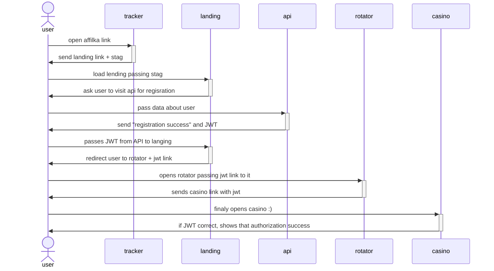

## Userflow
For end user flow looks like that:

Where:
- tracker: is an affilka tracker. You can attach different domains to it, also you have to register all landings as destinations in it.
- landing: this is marketing with marketing form
- api: this is API that landing should use for acquiring information about currencies, promo codes etc. And the main: this API used for user registration. This is crucial – if this API blocked, none of landings will work. Please be aware of that and keep an eye to use some domain that is not blocked for hosting API. If you can't – we can proxy requests to that API using landing itself, but it should be supported by API (to be discussed)
- rotator: some web app, that determines with of casino URL should be used by customer. I actually don't know why you need that, but it was requested to use it.
- casino: actually product


Caveats:
- api used for registration could have another domain rather final casino domain (which is obtained at rotator). Because of that, cookie authorization does not work (because cookies stick to issuing domain – API domain). That's why we have to request some additional JWT functionality. If we can use real casino domain as API domain – we can avoid passing JWT and cut of rotator part.
- we should implement integration with ReCAPTCHA to avoid API DDoS.
- we should implement affilka integration (it's a bit unclear how for now, because `/api/client/partner/track_stag` seems like a method for casino, not landing)

## Landing deploy schema

```meramaid
flowchart TD
    Git --> |CI CD deploy on commit| Pages1[CF Pages 1]
    Pages1 --> |linked in CF admin panel or API| Domain1a[domain1.com]
    Domain1a --> |Pages live inside bucket| Landing/Page1[domain.com/aaa]
    Domain1a --> Landing/Page2[domain.com/bbb]
    Domain1a --> Landing/Page3[domain.com/ccc]
    Git --> Pages2[pages bucket 100 domains]
    Pages2 --> Domain2a[domain2a.com]
    Pages2 --> Domain2asub1[sub1.domain2a.com]
    Pages2 --> Domain2asub2[sub2.domain2a.com]
    Pages2 --> Domain2b[domain2b.com]
    Domain2asub2 --> Landing2asub2/Page2[sub2.domain2a.com/bbb]
    Domain2asub2 --> Landing2asub2/Page23[sub2.domain2a.com/ccc]
```