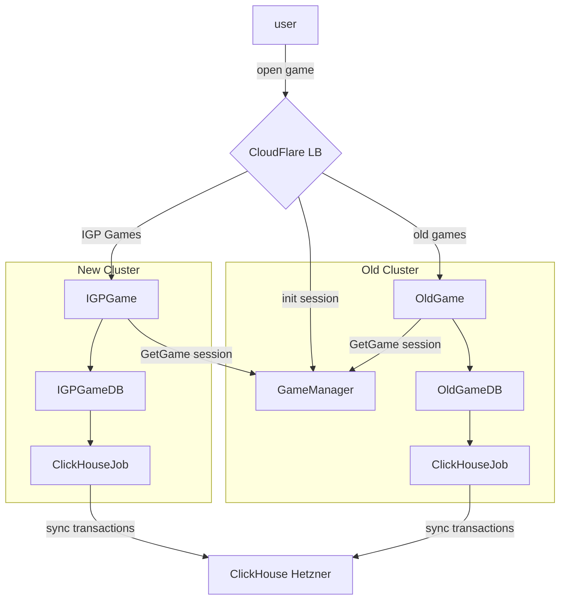

Goal: start shifting prod to new GKE cluster.
We want to start by moving IGP games to new production cluster.

### How it will work

We're going to split requests on CloudFlare LB level. As a first target we choose IGP games. We will move them to new cluster, and serve from GKE.

We don't want to touch GameManager, that's why we will make a network request on each game init, to obtain session from game manager. It's a point of fail, it could cause long game start, that should be checked before transferring more games to new cluster.

The GameDB itself does not require replication between clusters, it requests to have one initial transaction to work with provability fair, but data itself is not valuable after sync with ClickHouse. Spinning two GameDB's at the same moment wouldn't cause problems, because transactions could be synced independently. That's why for start we can keep both instances of IGP games — in Old Cluster and in a New Cluster. If something goes wrong (like long game start or anything else — we will just switch to old one)

### pinpoints
- add alert on failing tunnel between clusters (now it will cause game outage)
- add ClickHouseJob in a new cluster, and check that transactions correctly synced to ClickHouse.
- add option to make fast switch between clusters.