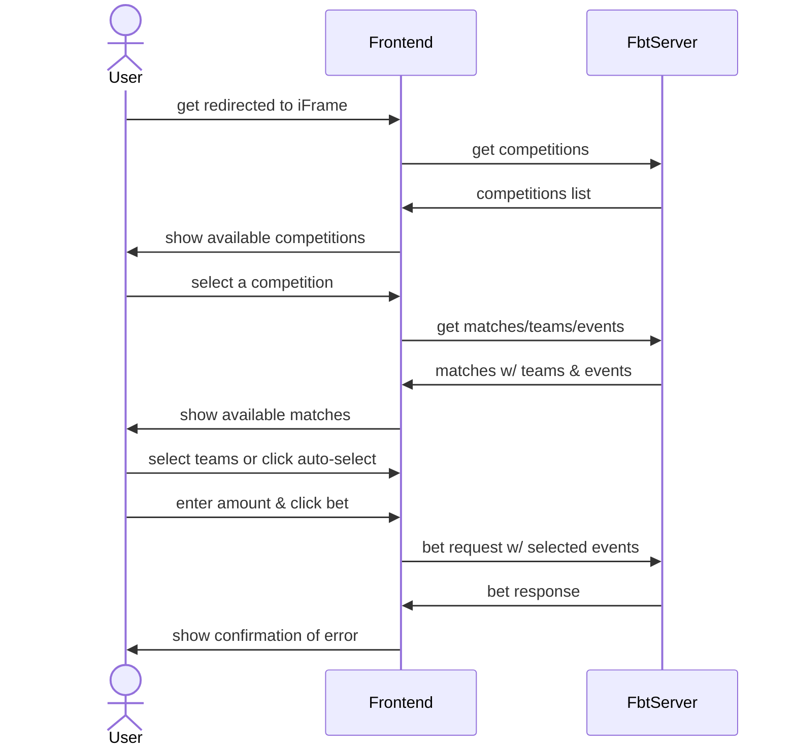

# General FE Flow

General flow can be explained by the following diagram:

Once session is initialized, user will be redirected to FE iFrame url. This url
will contain the following query parameters:

| Name           | Type    | Required | Description                                                                                   |
|----------------|---------|----------|-----------------------------------------------------------------------------------------------|
| `sessionId`    | uuid    | true     | FbtServer's session id, primary way of identifying user                                       |
| `locale`       | string  | true     | 2-letter code in the ISO 639-1 format(e.g. `en`, `de`, `es`)                                  |
| `currency`     | string  | true     | 3-letter code in the ISO 4217 format(e.g. `USD`, `EUR`, `GBP`)                                |
| `denomination` | integer | true     | Currency's number of digits after the decimal separator(e.g. `EUR` - 2, `JPY` - 0, `CLF` - 4) |

Backend API can be split into 2 main parts:

1. Auto-generated API for retrieval of synced entities from PayloadCMS. This
includes entities such as `competitions`, `teams`, `matches` & `events`. More
about API can be found here: https://payloadcms.com/docs/rest-api/overview.
Those endpoints will be available using token auth for read-only access.

2. Other custom endpoints which are described in [swagger](./openapi.yml) file.
Currently, the only Fe-facing endpoint is bet endpoint.