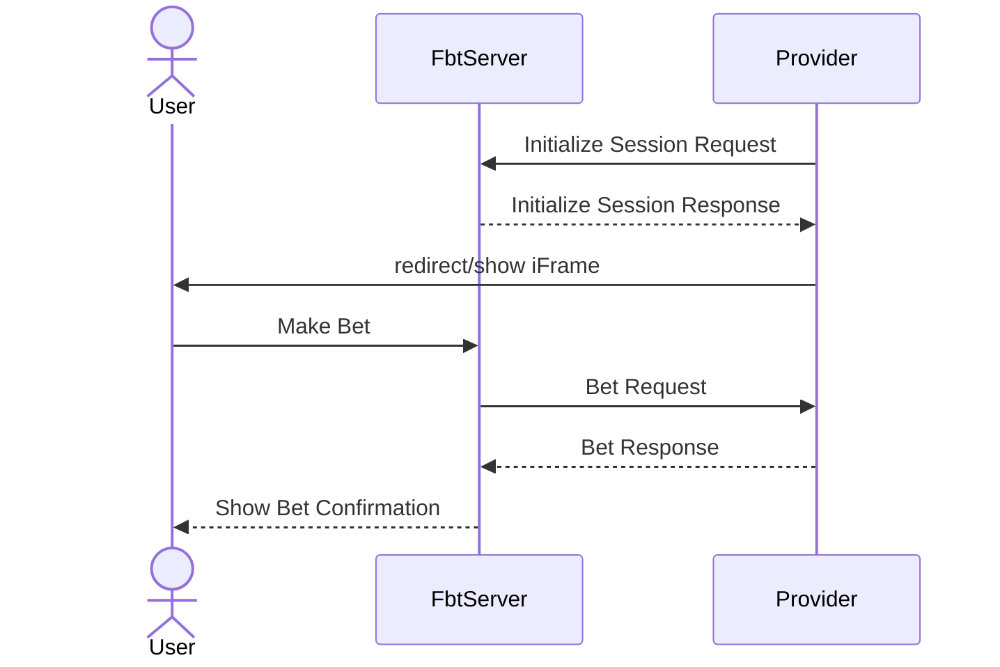

# Dictionary

- `FbtServer` - integration on the side of NodeArt, working name
- `Provider` - platform/API with which FbtServer will integrate
- `User` - user of Provider's platform
- `Event` - one of the outcomes of the match on which odds User places a
  bet(e.g. home team wins, match ends in a draw, away team wins 2-1, etc.)
- `Slip` - a list of events on which User makes a bet

# Assumptions

Provider already has internal structure and formats which it already uses
internally(e.g. ids, data structures, etc.) and in order to ease integration,
FbtServer will adapt to already existing formats as much as possible. However,
all new developments are subject to change.

# Overview

We can split API into 2 distinct flows:

1. Starting user session & making bets. General flow can be explained by the
following diagram:



Relevant sections:
- [Session Initialization](#session-initialization)
- [Making a Bet](#making-a-bet)

2. FbtServer retrieving data updated from the Provider

This API is implemented on the side of Provider and allows FbtServer to retrieve
information about business entities

Relevant Sections:
- [Data Syncing](#data-syncing)

# API

Request and response messages are sent in JSON format using HTTP POST protocol.

## Auth

All requests will require basic authorization. This requires supplying
`Authorization` header with content `Basic ` followed by the base64-encoded
`user:password` string. Additionally, request/response body can be encrypted or
contain its own hash if requested by the Provider.

## Error handling

In case request can not be successfully processed, endpoint must return response
containing details of an error. Error response must have 4xx/5xx HTTP status
code and contain `errorCode` to indicate type of an error. It may also include
any other details that may help with resolving an issue from the requester's
side.

> Note: The following are just examples of how error details can be communicated
and may be changed at the request of Provider.

Potential error codes(to be discussed):

| Name                       | Description                                       | Additional fields                                  |
|----------------------------|---------------------------------------------------|----------------------------------------------------|
| INTERNAL_SERVER_ERROR      | Internal Server Error                             | -                                                  |
| BAD_REQUEST                | Request is invalid                                | `message`,`details`                                |
| BET_MIN_LIMIT              | Bet amount is below min limit                     | `limit`                                            |
| BET_MAX_LIMIT              | Bet amount is above max limit                     | `limit`                                            |
| BET_INSUFFICIENT_FUNDS     | Bet amount is higher than user's wallet amount    | `walletAmount`, `denomination`, `currency`         |
| RISK_REFUSAL               | Bet was rejected due to risk refusal              | `displayMessage`                                   |
| RISK_REFUSAL_TOO_MANY_BETS | Bet was rejected due to user making too many bets | -                                                  |

```ts
interface {
  error: {
    errorCode: string;
    [s: string]: unknown;
  }
}
```

Examples:
```json
{
  "error": {
    "errorCode": "INTERNAL_SERVER_ERROR"
  }
}
{
  "error": {
    "errorCode": "BET_MIN_LIMIT",
    "limit": 500
  }
}
{
  "error": {
    "errorCode": "BET_INSUFFICIENT_FUNDS",
    "walletAmount": 1570,
    "denomination": 2,
    "currency": "EUR"
  }
}
{
  "error": {
    "errorCode": "BAD_REQUEST",
    "message": "Could not parse request body",
  }
}
{
  "error": {
    "errorCode": "BAD_REQUEST",
    "message": "Invalid request parameters",
    "details": [
      {
        "path": "userId",
        "message": "Value is missing"
      },
      {
        "path": "amount",
        "value": -12.76,
        "message": "Value must be positive"
      }
    ]
  }
}
```

## Session Initialization

Create a new session with which user can make bets.

Method: `POST`
Endpoint: `/api/v1/session/init`

### Request

```ts
interface {
  userId: string;
  currency: string;
  locale: string;
}
```

| Name       | Type   | Required | Description                                                          |
|------------|--------|----------|----------------------------------------------------------------------|
| `userId`   | string | true     | global user id on the side of Provider, format is up to the Provider |
| `currency` | string | true     | 3-letter code in the ISO 4217 format(e.g. `USD`, `EUR`, `GBP`)       |
| `locale`   | string | true     | 2-letter code in the ISO 639-1 format(e.g. `en`, `de`, `es`)         |

Example:
```json
{
  "userId": "cdaae822-6747-401b-b268-e3547ee0fdbe",
  "currency": "EUR",
  "locale": "de"
}
```

### Response

```ts
interface {
  redirectUrl: string;
  sessionId: string;
}
```

| Name          | Type   | Required | Description                                        |
|---------------|--------|----------|----------------------------------------------------|
| `redirectUrl` | string | true     | url for the iframe which will be shown to the user |
| `sessionId`   | uuid   | true     | FbtServer's session id, primarily for audit purposes  |

> Note: redirect url will contain FbtServer's internal parameters which will
allow it to identify & validate session. They are not relevant for the
Provider's side.

Example:
```json
{
  "redirectUrl": "https://some.domain.name/path/to/iframe?some=internal&session=paramaters",
  "sessionId": "9f3ce342-17c8-416c-a51a-a8145285bb51"
}
```

## Making a Bet

Place a bet for a user. User can make multiple bets within a single session.

Method: `POST`
Endpoint: `/api/v1/bet`

### Request

```ts
interface {
  userId: string;
  sessionId: string;
  idempotencyId: string;
  timestamp: integer;
  currency: string;
  denomination: integer;
  amount: integer;
  slip: {
    eventId: string;
    stake: integer;
    event?: {
      matchId: string;
      type: string;
      odds: integer;
    }
  }[];
}
```

| Name            | Type         | Required | Description                                                                                    |
|-----------------|--------------|----------|------------------------------------------------------------------------------------------------|
| `userId`        | string       | true     | global user id on the side of Provider, format is up to the Provider                           |
| `sessionId`     | uuid         | true     | FbtServer's session id, primarily for audit purposes                                           |
| `idempotencyId` | uuid         | true     | idempotency id for bet request                                                                 |
| `timestamp`     | integer      | true     | unix timestamp, for audit purposes                                                             |
| `currency`      | string       | true     | 3-letter code in the ISO 4217 format(e.g. `USD`, `EUR`, `GBP`)                                 |
| `denomination`  | integer      | true     | Currency's number of digits after the decimal separator(e.g. `EUR` - 2, `JPY` - 0, `CLF` - 4)  |
| `amount`        | integer      | true     | bet amount(e.g. for amount `1275` `EUR`(denomination `2`), display amount will be `12.75 EUR`) |
| `slip`          | object array | true     | list of events on which bet is made                                                            |
| `eventId`       | string       | true     | event id on the side of Provider, format is up to the Provider                                 |
| `stake`         | integer      | true     | event stake, positive integer                                                                  |
| `event`         | object       | false    | copy of Provider's data of the [Event](#event)                                   |

> Discuss: Which parts of the event change after it has been created(e.g. match
it belongs to, its type, odds, etc.)? In order to avoid de-sync of event's data
between the time FbtServer obtained data from the Provider and the time user
makes a bet, we need to make sure that bet request contains information about
assumed bet state. One of the solutions is to pass a complete copy of the event
(in the `event` field) that FbtServer knows of and Provider checks that that
data is still valid. Alternatively, if Provider can provide a timestamp of the
time event was updated, we could send only it which simplifies validation on the
side of the Provider. And in case nothing about the event changes after its
creation, we could skip this check completely.

Example:
```json
{
  "userId": "cdaae822-6747-401b-b268-e3547ee0fdbe",
  "sessionId": "9f3ce342-17c8-416c-a51a-a8145285bb51",
  "idempotencyId": "57a743c3-8269-4b43-bfd0-1d65973fcb1d",
  "timestamp": 1771854042536,
  "currency": "USD",
  "denomination": 2,
  "amount": 1275,
  "slip":[
    {
      "eventId": "23492342",
      "stake": 3,
      "event": {
        "id": "23492342",
        "matchId": "523543",
        "type": "0-0",
        "odds": 3.74,
        "active": true,
        "updatedAt": 1772014764187
      }
    },
    {
      "eventId": "4564362",
      "stake": 4,
      "event": {
        "id": "4564362",
        "matchId": "523205",
        "eventType": "1",
        "odds": 5.12,
        "active": true,
        "updatedAt": 1772014764187
      }
    },
    {
      "eventId": "4564094",
      "stake": 2,
      "event": {
        "id": "4564094",
        "matchId": "523863",
        "eventType": "X/X",
        "odds": 2.28,
        "active": true,
        "updatedAt": 1772014764187
      }
    }
  ],
}
```

### Response

```ts
interface {
  betId: string;
}
```

| Name    | Type   | Required | Description                                                                                            |
|---------|--------|----------|--------------------------------------------------------------------------------------------------------|
| `betId` | string | true     | created bet id on the side of Provider, format is chosen by the Provider, primarily for audit purposes |

Example:
```json
{
  "betId": "7b513ad7-1d6d-4c5f-a0e8-ba4091357099"
}
```

## Data Syncing

In order for FbtServer to show relevant information to the user, it needs to
retrieve a list of business entities such as:
- competitions(e.g. `Premier League`, `Bundesliga`, `La Liga`, etc.)
- teams(e.g. `Arsenal`, `Brighton`, `Chelsea`, etc.)
- matches(e.g. `Arsenal vs Brighton at 2026.01.01 12:30 in Premier League`)
- events(e.g. match with id `5269` ends in a draw with odds of 2.56)

It is critical that FbtServer operates with up-to-date entities in order to
avoid situations where for example, odds for an event shown to the user differ
from the ones Provider has.

One of the ways to achieve that is for FbtServer to make repeated API calls
providing timestamp of the last time one of the business entities was updated in
which case Provider will return a list of entities that were updated after that
point of time. Additionally, to handle use-case where id for a non-synced entity
is returned in the response of another entity, API will provide a way to
retrieve a list of entities by specifying their ids in the request. In case such
implementation will cause significant strain on
Provider's API, other options can be discussed.

> Discuss: do we need multiple formats/resolutions for the logo or are we going
to have a single format/resolution displayed to the user in all places?

API for all entities work identically, so when using competition in the
following examples, same logic can be applied to other entities.

### Request

Method: `GET`
Endpoint: `/api/v1/competitions`

Query Parameters:

| name    | type    | description                                                       |
| ------- | ------- | ----------------------------------------------------------------- |
| `from`  | integer | timestamp of the last updated date. Mutually exclusive with `ids` |
| `ids`   | string  | comma-separated ids of entities that need to be retrieved         |
| `limit` | integer | max number of entries in the result                               |
| `page`  | integer | request page                                                      |

Examples:
1. `GET https://domain.com/api/v1/competitions?from=1772014764187&limit=100&page=1`
2. `GET https://domain.com/api/v1/competitions?ids=32,134,52,17&limit=50&page=2`

### Response

| name    | type         | description                                            |
|---------|--------------|--------------------------------------------------------|
| `data`  | object array | array of data entities, structures are described below |
| `page`  | integer      | current page                                           |
| `limit` | integer      | max number of entries in the result                    |
| `total` | integer      | total number of entries across all pages               |

```ts
interface {
  data: {
    id: string;
    name: string;
    logo: string;
    updatedAt: integer;
  }[];
  paging: {
    page: integer;
    limit: integer;
    total: integer;
  };
}
```

### Competition

| name        | type    | description                        |
|-------------|---------|------------------------------------|
| `id`        | string  | id of the competition/league       |
| `name`      | string  | name of the competition            |
| `logo`      | string  | url of the competition logo        |
| `updatedAt` | integer | timestamp of the last updated date |

Example:
```json
{
  "id": "134",
  "name": "Premier League",
  "logo": "https://some.domain.name/path/to/logo/image",
  "updatedAt": 1762018623661
}
```

### Team

| name        | type    | description                        |
|-------------|---------|------------------------------------|
| `id`        | string  | id of the team                     |
| `name`      | string  | name of the team                   |
| `logo`      | string  | url of the team logo               |
| `updatedAt` | integer | timestamp of the last updated date |

Example:
```json
{
  "id": "37142",
  "name": "Arsenal",
  "logo": "https://some.domain.name/path/to/logo/image",
  "updatedAt": 1771018674776
}
```

### Match

| name         | type    | description                        |
|--------------|---------|------------------------------------|
| `id`         | string  | id of the match                    |
| `homeTeamId` | string  | id of the home team                |
| `awayTeamId` | string  | id of the away team                |
| `date`       | integer | date of the match                  |
| `updatedAt`  | integer | timestamp of the last updated date |

Example:
```json
{
  "id": "523543",
  "homeTeamId": "37142",
  "awayTeamId": "18356",
  "date": 1774456200000,
  "updatedAt": 1771718730433
}
```

### Event

| name        | type    | description                                            |
|-------------|---------|--------------------------------------------------------|
| `id`        | string  | id of the event                                        |
| `matchId`   | string  | id of the match                                        |
| `type`      | string  | type of the event(e.g. `1`, `2-1`, `X-X`)              |
| `odds`      | float   | event odds, positive number, max precision: 2 decimals |
| `active`    | boolean | whether event can be better on                         |
| `updatedAt` | integer | timestamp of the last updated date                     |

Example:
```json
{
  "id": "23492342",
  "matchId": "523543",
  "type": "0-0",
  "odds": 3.74,
  "active": true,
  "updatedAt": 1772014764187
}
```