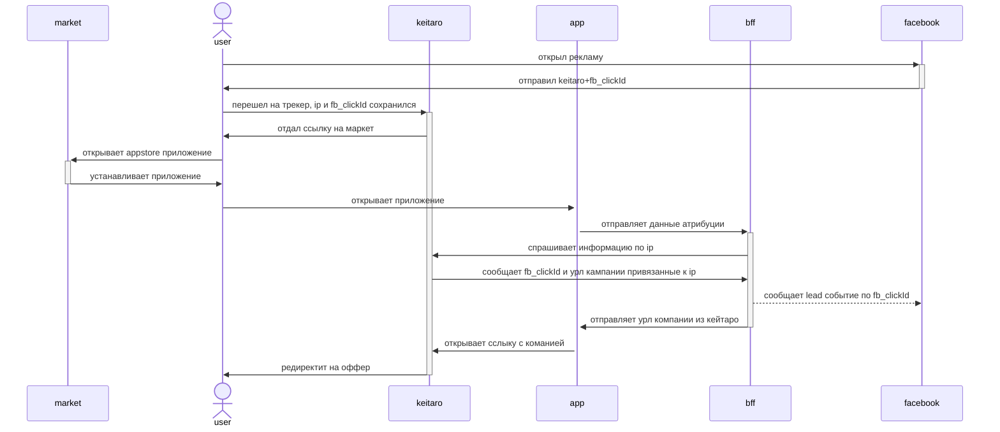

```mermaid
sequenceDiagram

participant market

actor user

participant keitaro

participant app

participant bff

  

    user ->>+ facebook: открыл рекламу

    facebook->>-user: отправил keitaro+fb_clickId

    user ->>+ keitaro: перешел на трекер, ip и fb_clickId сохранился

    keitaro ->> user: отдал ссылку на маркет

    user ->>+ market: открывает appstore приложение

    market ->>- user: устанавливает приложение

    user ->>+ app: открывает приложение

    app ->>+ bff: отправляет данные атрибуции

    bff ->> keitaro: спрашивает информацию по ip

    keitaro ->>bff: сообщает fb_clickId и урл кампании привязанные к ip

    bff -->> facebook: сообщает lead событие по fb_clickId

    bff ->>-app: отправляет урл компании из кейтаро

    app ->> keitaro: открывает сслыку с команией

    keitaro ->>- user: редиректит на оффер
```