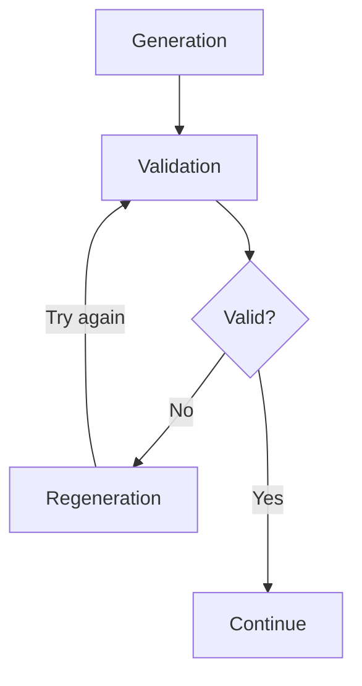

# Basic principles of prompt parameters' usage

When using a prompt to perform text generation, some of the parameters / data
will only be available during the execution. To access them, parameters can be
used in prompts using double curly braces(e.g. `{{parameterName}}`).
In case parameter value type is a JSON object, its serialized structure can be
restricted to optimize token usage by specifying properties in square brackets
like so: `{{parameterName[property1,property2]}}`. All unknown properties will
be ignored and all empty properties will be omitted.

For example, assuming we have the following parameters available:
- `name` - `John Doe`
- `language` - `German`
- `country` - `UK`
- `city` - `London`
- `people` - `[{"name":"Jake","surname":"Smith","age": 20},{"name":"Joe","surname":"Jones","age":30}]`

and the following prompt is used:

```
Generate some text in {{language}} language about time {{name}} spent in {{country}} speaking {{language}} about {{topic}}.
People he talked with:
{{people[name,age]}}
Full info on people:
{{people}}
```

the final message that will be passed to LLM will be:

```
Generate some text in German language about time John Doe spent in UK speaking German about {{topic}}.
People he talked with:
[{"name":"Jake","age": 20},{"name":"Joe","age":30}]
Full info on people:
[{"name":"Jake","surname":"Smith","age": 20},{"name":"Joe","surname":"Jones","age":30}]
```

Take note that parameter can be used multiple times in prompt and vice versa - even if parameter is available, it is not required to use it in the prompt. If you use parameter that is not in the list of available parameters, it will be ignored and left as is.

Please note that this is just an example for demonstration, for details on
which parameters are available in each prompt, read below.

# Article generation

## Globally available parameters for article generation

Parameters listed here will be available for all article generation prompts, but
will only be listed here to avoid duplication.

Generation parameters(provided when starting generation):
- `language` - string, optional
- `country` - string, optional
- `requests` - string, optional
- `lsiWords` - string, optional

Database(available in our internal DB):
- `casinos` - JSON, required. If casinos are selected when submitting request, data will be limited to those entries, otherwise all data will be provided.

## Web Search prompt

Optionally Perform web search related to article type.

Output: text, saved in `webSearchPrompt` parameter

## Summarize prompt

Summarize data to avoid duplicate information & optimize token usage.

Available parameters:
  - `webSearchPrompt` - string, optional

Output: text, saved in `summarizedText` parameter

## Sections' prompts

Section is generated in several stages:
- `generation` - initial generation of text
- `validation` - check that text satisfies certain requirements(e.g. writing style)
- `re-generation` - in case `validation` step did not pass, generate text again and go to `validation` step again

This will repeat until validation passes or we run out of attempts(configurable for each article generation template)



Each section has its own name which will determine parameter name under which
it will be available in later stages of generation. Upon successful generation,
result will be saved in parameter which will consist of section name and
`Section` string concatenated together (e.g. if section is named `paymentMethods`,
it will be available as `paymentMethodsSection` parameter).

### Generate prompt

Generate text for this section.

Available parameters:
  - `webSearchPrompt` - string, optional
  - `summarizedText` - string, required

Output: markdown-formatted text, saved in `markdownText` parameter

### Validate prompt

Evaluate text quality, whether it satisfies style requirements, etc.

Available parameters:
  - `webSearchPrompt` - string, optional
  - `summarizedText` - string, required
  - `markdownText` - string, required

Output: JSON, with the following format:

```json
{
  "valid": <true/false>,
  "feedback": "<optional feedback>"
}
```

  - `valid` - boolean, required, whether validation passed
  - `feedback` - string, optional, to be used in the next attempt, saved in `feedback` parameter

### Re-Generate prompt

Generate text for the section again, with optionally provided feedback.

Note that messages from original generation or validation completions will not
be added automatically to conversation to allow for greater flexibility. To
achieve a chained conversation, several messages should be provided with
alternating roles and appropriate content in each of them.

Available parameters:
  - `webSearchPrompt` - string, optional
  - `summarizedText` - string, required
  - `markdownText` - string, required
  - `feedback` - string, optional

Output: markdown-formatted text, saved in `markdownText` parameter

## Transform HTML prompt

Transform generated sections to html

Parameters:
  - `webSearchPrompt` - string, optional
  - `summarizedText` - string, required
  - `<sectionName>Section` - string, result of generation of the specific section.
  - `htmlStyle` - string, optional, `Template HTML Style`'s prompt

Output: valid html text.

# Casino sync

## Description prompt

Parameters:
- `name` - string, required
Output: text

## Player Reviews prompt

Parameters:
- `name` - string, required
Outout: integer, range - [1, 100]

## News prompt

Parameters:
- `name` - string, required
Output: text

# Provider sync

## News prompt

Parameters:
- `name` - string, required
Output: text