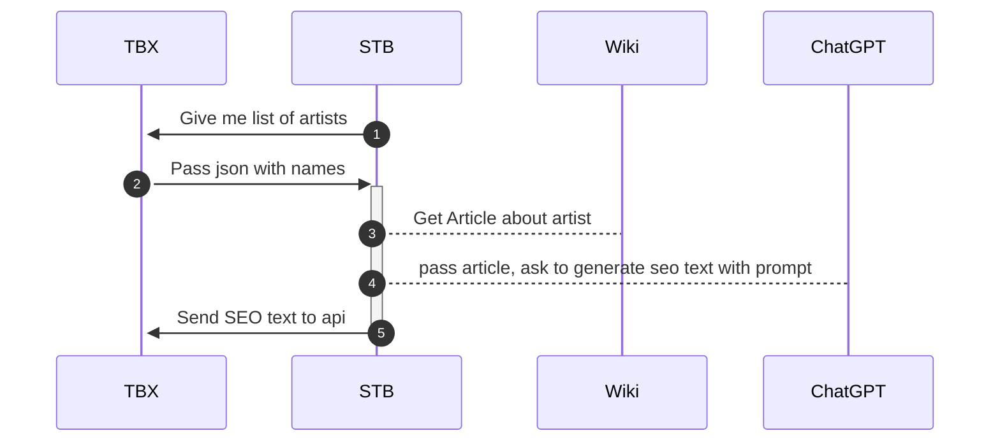

Цель: генерировать сеошные тексты для страницы артиста на сайте, к примеру https://antytila.ticketsbox.com/
Для этого мы хотим добавить текстовый блок снизу сайта.

Для генерации этого блока мы хотим использовать pipelines из STB.

Предполагаемый сценарий работы.


Со стороны TBX необходимо создать два ендпоинта:

`tbx.ua/api/seo/list?key=xxxx`
```json
{
  artistis: [
	  {
	    id: "234", 
	    name: [
	      {key: "en": name: "назва артиста англійською"},
	      {key: "ua", name: "назва артиста українською"},
	    ]
	  },
	  {
	    id: "333", 
	    name: [
	      {key: "en": name: "назва артиста англійською"},
	      {key: "ua", name: "назва артиста українською"},
	    ]
	  }
  ]
}
```
Если какая-то из языковых версий у нас уже присутвует, то мы не выводим ключ заданного языка в массиве name.


`tbx.ua/api/seo/artist?key=xxxx`
```json
{
  artistis: [
	{id: "234", lang: "ua", "seoText": "тут будет сеошный текст"},
	{id: "234", lang: "en", "seoText": "here will be seo text"},
  ]
}
```

Со стороны STB:

Мы будем получать список имен, для каждого языкового ключа и имени. Далее мы в языковой версии википедии ищем статью с именем артиста, скачиваем статью, и используем ее в промпте для генерации сеоТекста. Для генерации используем новый экземпляр `article generations flow`, с названием к примеру TBX-artist.

Если статью не получилось создать, или если не получилось найти артиста в википедии — мы тихо умираем и ничего не отправляем в tbx. В следующий раз как загрузим список артистов — попробуемм еще раз.

Адреса endpoints можем задать через ENV.

Скорость генерации должна регулироваться CRON + лимит на количество артистов за раз. К примеру по 10 штук брать. При этом мы должны в 10 штук не учитывать те, генерация которых упадет.