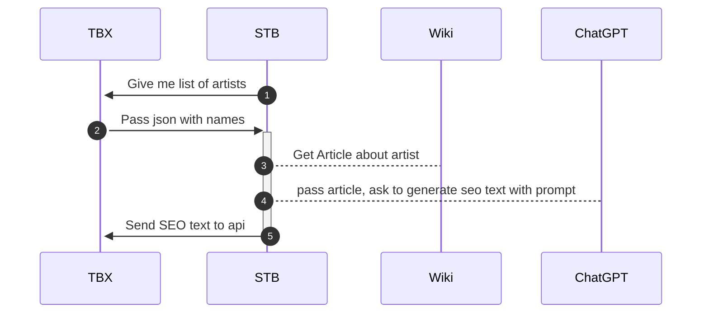

Цель: генерировать сеошные тексты для страницы артиста на сайте, к примеру https://antytila.ticketsbox.com/
Для этого мы хотим добавить текстовый блок снизу сайта.

Для генерации этого блока мы хотим использовать pipelines из STB.

Предполагаемый сценарий работы.


Со стороны TBX необходимо создать два ендпоинта:

`tbx.ua/api/seo/list`
```json
{
  artistis: [
	  {
	    id: "234", 
	    name: [
	      {key: "en": name: "назва артиста англійською"},
	      {key: "ua", name: "назва артиста українською"},
	    ]
	  },
	  {
	    id: "333", 
	    name: [
	      {key: "en": name: "назва артиста англійською"},
	      {key: "ua", name: "назва артиста українською"},
	    ]
	  }
  ]
}
```
Если какая-то из языковых версий у нас уже присутвует, то мы не выводим ключ заданного языка в массиве name.


`tbx.ua/api/seo/artist`
```json
{
  artistis: [
	{id: "234", lang: "ua", "seoText": "тут будет сеошный текст"},
	{id: "234", lang: "en", "seoText": "here will be seo text"},
  ]
}
```

## Примеры прод данных
адреса:
список https://ticketsbox.com/?route=api/seo_artist/list
модификатор https://ticketsbox.com/?route=api/seo_artist/put&key=

в список кроме id и name добавил:
crm_id - ид ЦРМ
category - если артисту выставлена главная категория 
country - если выставлена страна
priority - 0 - нет и не было ивентов,  1 - только архив, 2 и выше - либо есть сейчас либо было много ивентов в архиве
пример ответа
```json
  {
    "id": "361",
    "name": [
      {
        "key": "ru",
        "name": "Лаура Марти (Laura Marti)"
      },
      {
        "key": "en",
        "name": "Laura Marti"
      },
      {
        "key": "ua",
        "name": "Лаура Марті (Laura Marti)"
      }
    ],
    "priority": 1,
    "crm_id": "/api/v1/artists/139", // это поле опциональное
    "category": "Концерт", // это поле опциональное
    "country": "Україна" // это поле опциональное
  }
```

закрылся от посторонних глаз обязательным хеадером
`x-apikey`: `8a58375c-3086-4424-b17e-7cb4570b73a1`

Пример запроса:
```bash
curl --request GET \ 
  --url 'https://ticketsbox.com/?route=api%2Fseo_artist%2Flist' \ 
  --header 'x-apikey: 8a58375c-3086-4424-b17e-7cb4570b73a1'
```
Отсутствие ключа для уже заполненных данных работает.

Пример запроса на обновление:
![[TBX-seo-update-query.png]]

Со стороны STB:

Мы будем получать список имен, для каждого языкового ключа и имени. Далее мы в языковой версии википедии ищем статью с именем артиста, скачиваем статью, и используем ее в промпте для генерации сеоТекста. Для генерации используем новый экземпляр `article generations flow`, с названием к примеру TBX-artist.

Если статью не получилось создать, или если не получилось найти артиста в википедии — мы тихо умираем и ничего не отправляем в tbx. В следующий раз как загрузим список артистов — попробуемм еще раз.

Адреса endpoints можем задать через ENV.

Скорость генерации должна регулироваться CRON + лимит на количество артистов за раз. К примеру по 10 штук брать. При этом мы должны в 10 штук не учитывать те, генерация которых упадет.