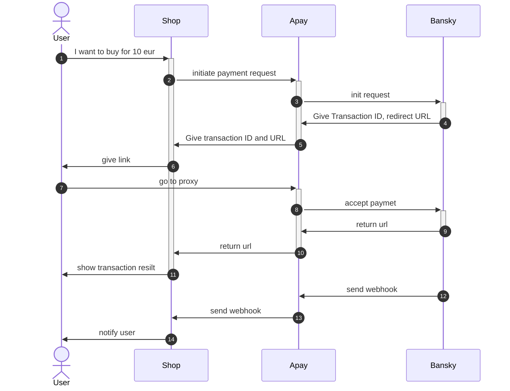

# AimbrellaPay
## Goal:
сделать прокси платежку, для доступа к bansky, без передачи токенов доступа клиентам.
## Instruments
- sveltekit, cloudlfare pages, cloudflare kv, google bigquery, metabase
## Flow

1. how user asks to make a payment is out of scope for us, but its REQUIRED to have VALIDATED customer email, before requesting payment.
2. Initiate payment method from shop to Apay
POST /api/v1/init-payment
Header Authorization: Token
```json
{
 id:"sddc", // transaction id, used to identify posback, if no id - no postback
 email:"user@example.com", // validated user email, required
 name:"UserName", // username, optional field
 amount: 100, // amount of transaction
 currency: "USD", // three-letter ISO currency code
 type: "fiat|crypto", // used to separate fiat from crypo (could we remove that?)
 sussessUrl: "https://shop.com/success", // where to redirect user after successful payment 
 errorUrl: "https://shop.com/error", // where to redirect user after unsuccessfull payment 
 postbackUrl:"https://shop.com/api/payment-verify" // where to send payment notify
}
```
We store all that data in BQ for further analysis.
If data validated, we proceed request to Bansky.
3. We send request to bansky, with the same params, but making substitution to our fields.
Bansky init:
```json
{
 id:"ourintrenalid", // transaction id, used to identify posback, if no id - no postback
 email:"user@example.com", // validated user email, required
 name:"UserName", // username, optional field
 amount: 100, // amount of transaction
 currency: "USD", // three-letter ISO currency code
 type: "fiat|crypto", // used to separate fiat from crypo (could we remove that?)
 sussessUrl: "https://apay.com/integration/success", // where to redirect user after successful payment 
 errorUrl: "https://apay.com/integration/error", // where to redirect user after unsuccessfull payment 
 postbackUrl:"https://apay.com/api/payment-verify" // where to send payment notify
}
```
4. Getting response from Banksy
```json
{
url: "paymentlink.com"
}
```
6. Attaching Bansky responce to initial BQ data regarding transaction, storing url and ids in KV, and giving our wrapper url to shop.
```json
{
status: "success",
id: "id",
url: "apey.com/integration/pay?id=xxxx"
}
```
7. When user gets to our link, we unpack real payment url stored in KV and redirect user there,
8. user gets to bansky and makes a payment
9. user redirected to our success/error wrapper
10. we restore shoup urls from wrapper, and redirect user ther
12. when we got payment postback, we get id from kv and transfer it to shop
## Functional blocks
### API
Actually api, with login of all transactions in KV.
### DOCS
Public docs, on how to integrate with our payment api
### Internal DOCs
password protected docs, with info on how to add new tokens and how to measure stats

### Reporting
Metabase dashboards, embedded into app to show stats and filters for customer.