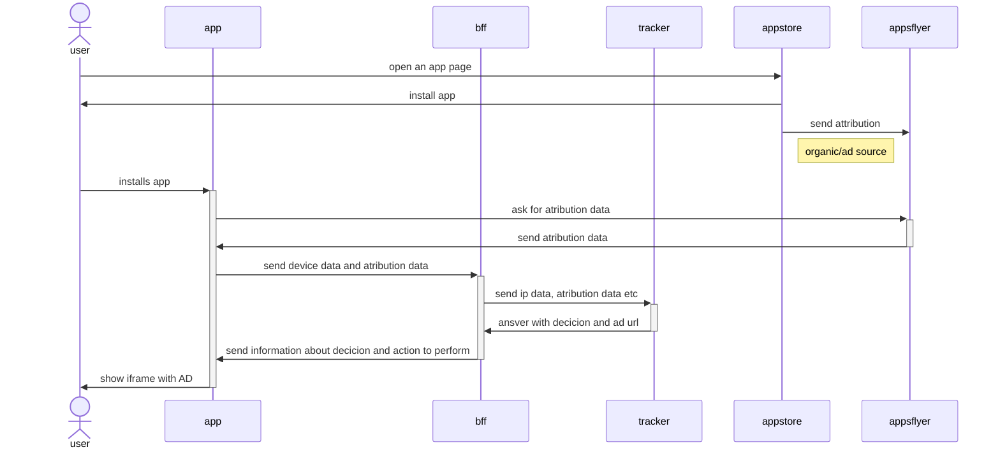

User flow for apps and tracker integration

Where:
- bff: is a light proxy on app domain, which can store logs and responsible to integration with tracker (at this point we can change implementation without making changes to app in store)
- tracker: is a decision-making app, Binom or something else

What should we keep in mind:
- organic traffic should be excluded from AD at first step to avoid app block
- bff should be published at app domain with https/v3 enabled
- we show loading screen until we receive answer from BFF, if there is timeout (like 10 seconds or something like that) we go to normal game.